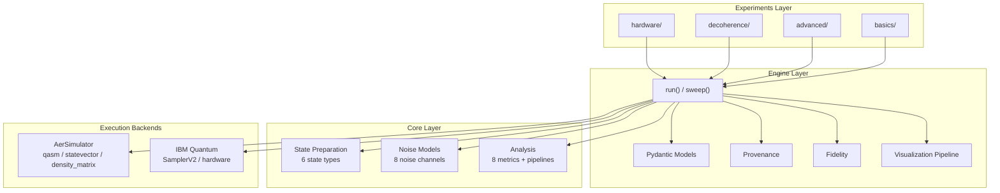
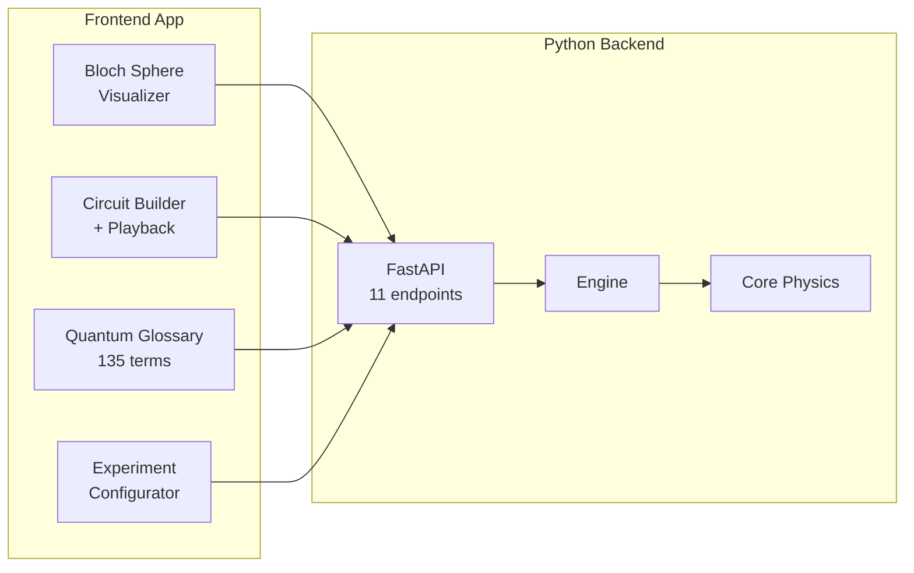

# QForge

[](https://github.com/RDOToole89/qiskit-experiment-framework/actions/workflows/ci.yml)
[](LICENSE)
[](https://www.python.org/downloads/)

**A general-purpose quantum experiment engine built on Qiskit — for learning, research, and real hardware.**

## Table of Contents

- [What Makes This Different](#what-makes-this-different)
- [Architecture](#architecture)
- [Features at a Glance](#features-at-a-glance)
- [Quick Start](#quick-start)
- [Learning Path](#learning-path)
- [Research](#research-structured-decoherence-on-real-hardware)
- [Experiments](#experiments)
- [Tech Stack](#tech-stack)
- [Contributing](#contributing)
- [License](#license)

I'm a software engineer, not a physicist. I fell in love with quantum mechanics as a kid watching BBC science programs — Schrodinger's cat completely blew my mind. When I asked my teacher about it, she said: *"We're not discussing that in this class."* I never ended up in physics.

About eight years ago, stuck in the Australian outback on a working-holiday visa — isolated from the world for three months with nothing but an internet connection — I started watching physics lectures from the Royal Institution. Sean Carroll's clarity and elegance in explaining physics was addictive. I fell in love with the topic all over again and went deep: thousands of hours of lectures and videos from all kinds of thinkers. I'm particularly inspired by Deutsch and Marletto's constructor theory — the idea that physics should be framed in terms of what transformations are and aren't possible.

That inspiration led to a specific question: **if we can characterize the *structure* of how quantum states decohere — not just how fast, but in what pattern — could we predict decoherence pathways and build smarter error correction?** That's speculative, and I'd be the first to admit it. But the question drove me to build this framework, which grew into something much more general than my original research direction.

The core idea is simple: **abstract away the hard parts of quantum experimentation**. You pick a quantum state, choose a noise model, configure your simulation (or point it at real hardware), and hit run. The framework handles circuit construction, noise application, execution, measurement canonicalization, and structured analysis output — all through a clean two-function API. Results come back as typed Pydantic models with provenance, metrics with confidence intervals, and schema-compliant output you can actually analyze programmatically.

This framework sits between a teaching tool and a research instrument. It's educational enough to learn from (interactive Bloch sphere, 135-term glossary, 22 preset circuits with step-by-step explanations) and rigorous enough to produce results worth discussing (8 information-theoretic metrics with bootstrap CIs, 4 simulation backends, real IBM Quantum hardware integration with full provenance). I've used it to run experiments on three IBM quantum processors, and the results were interesting enough to write up.

I'm open-sourcing it because I believe quantum computing should be accessible to anyone willing to tinker — you don't need a physics PhD to set up an experiment, visualize a quantum state, or explore how noise shapes entanglement. I hope this framework helps spark that curiosity in others the way Sean Carroll's lectures sparked it in me.

---

## What Makes This Different

Most quantum computing tools are either toy tutorials or impenetrable research code. This framework tries to be the bridge:

- **Learn by doing** — 22 preset circuits with step-by-step explanations, animated Bloch sphere playback, entanglement analysis at every gate
- **Progress to research** — same engine that teaches Bell states also runs 47-condition sensitivity studies on real hardware
- **See the physics** — every experiment produces visualizable output: Bloch vectors, correlator spaces, mutual information heatmaps, decoherence sweeps
- **Run on real hardware** — `sim_mode="hardware"` sends your circuit to IBM Quantum with full transpilation and calibration capture

---

## Architecture

The framework has three clean layers. The engine doesn't know about decoherence. The core doesn't know about experiments. Each layer is independently useful.





**Key principle**: `src/core/` is pure physics — it has no idea what "structured decoherence" means. `src/engine/` orchestrates without domain knowledge. Only `src/experiments/` carries research-specific semantics. This means you can build completely new research programs on top of the same engine.

---

## Features at a Glance

### Python Engine

| | |
|---|---|
| **State types** | GHZ, W, Bell, Cluster, Superposition, Custom (pass any QuantumCircuit) |
| **Noise models** | Depolarizing, amplitude damping, phase damping, bit flip, phase flip, thermal relaxation, correlated depolarizing, readout error |
| **Simulation modes** | `qasm` (shot-based), `statevector` (exact), `density_matrix` (mixed state), `hardware` (IBM Quantum) |
| **Metrics** | 8 information-theoretic metrics with bootstrap 95% CIs and v1.0 schema |
| **Experiments** | 49 pre-built programs: basics (11 steps + 10 deep dives) → advanced (8 steps + 7 deep dives) → decoherence (6 steps + 2 deep dives) → hardware (5 steps + 3 deep dives) |
| **Hardware** | IBM Quantum via SamplerV2, auto-backend selection, transpilation capture, calibration snapshots |
| **Provenance** | Git SHA, software versions, host info, execution time, full reproducibility |
| **CLI** | `python -m src.cli list` / `run <experiment>` / `run-config <file>` |
| **API** | 11 FastAPI endpoints for experiments, results, and Bloch visualization |
| **Tests** | ~1,100 passing (1104), ~97% coverage on the physics/math core (all of `src/core` plus the engine math modules) behind a 95% gate |

### Visual Quantum Laboratory (React Native / Expo)

The frontend isn't just a dashboard — it's an **interactive quantum laboratory**. The Circuit Builder with live Bloch sphere playback is, as far as we know, unique: no existing tool combines drag-and-drop circuit construction, step-by-step 3D state visualization, and real-time entanglement analysis in a single integrated view.

| Feature | What it does |
|---------|-------------|
| **Circuit Builder + Bloch Playback** | Build circuits with 14 gate types, then **watch the quantum state evolve on a 3D Bloch sphere** step by step. Pause at any gate. Scrub back and forth. See per-qubit Bloch vectors computed via partial traces. 22 preset circuits (Bell, GHZ, QFT, QPE, Teleportation, Grover, etc.) with step-by-step explanations. |
| **Live Entanglement Analysis** | At every step of the circuit, see ΔCov correlation matrices, pairwise concurrence, and 3-tangle residual gauge. Watch entanglement appear and disappear as gates are applied. |
| **State Recognition** | Auto-detects known quantum states (Bell Φ+, GHZ, W, Cluster, Dicke) and displays educational context — what the state is, why it matters, and how it was constructed. |
| **Bloch Sphere Visualizer** | Interactive 3D noise channel visualization. Watch decoherence deform the Bloch ball. Sweep error rates. Compare probe states and topologies. Load real experiment results from the Python engine. |
| **Quantum Glossary** | 135 terms across 16 categories. Formal definitions, intuitive explanations, LaTeX equations, cross-linked navigation. |
| **Experiment Configurator** | Full GUI for building experiment configs: state type, noise model, simulation mode, hardware backend, metrics. Live circuit preview. |
| **Results Browser** | Browse, sort, and inspect past experiment results. |
| **Experiment Registry** | Discover and launch pre-built experiments with one tap. |

**What makes this different from IBM Quantum Composer, Quirk, or Qiskit widgets:**
- Step-by-step Bloch sphere animation with scrubber (not just final state)
- Multi-qubit Bloch view with per-qubit partial trace dots
- Entanglement metrics (ΔCov, concurrence, tangle) computed and displayed at every gate
- Connected to a real experiment engine — take the circuit you built and run it on IBM hardware
- 22 presets with educational narratives explaining *why* each gate is there, not just *what* it does

---

## Quick Start

### Run an Experiment (Python)

```bash
git clone https://github.com/RDOToole89/qiskit-experiment-framework.git
cd qiskit-experiment-framework

# Install uv once (https://docs.astral.sh/uv/), then:
uv sync   # creates .venv and installs everything from uv.lock

# List available experiments
uv run python -m src.cli list

# Run your first experiment
uv run python -m src.cli run bell_state

# Run with overrides
uv run python -m src.cli run ghz_exploration -s num_qubits=5 -s error_rate=0.1
```

> **Why `uv`?** It manages the Python interpreter (pinned to 3.12 via `.python-version`)
> and installs an exact, reproducible environment from the committed `uv.lock` — no manual
> venv or version juggling. `uv run <cmd>` runs `<cmd>` inside that environment.

### Use the Engine API

```python
from src.engine.api import run
from src.engine.models import ExperimentConfig

# Simple experiment
result = run(ExperimentConfig(
    num_qubits=4,
    state_type="GHZ",
    shots=4096,
    noise_enabled=True,
    noise_type="depolarizing",
    error_rate=0.05,
    metrics="structured_decoherence",
))

# Results are typed Pydantic models
print(f"Fidelity: {result.analysis.measurement_results.fidelity:.4f}")
for name, m in result.metrics_bundle.metrics.items():
    print(f"  {name}: {m.value:.4f}")
```

### Run on Real Hardware

```python
result = run(ExperimentConfig(
    num_qubits=6,
    state_type="GHZ",
    sim_mode="hardware",      # Send to IBM Quantum
    shots=8192,
    metrics="structured_decoherence",
))

print(f"Backend: {result.provenance.simulator_info['backend_name']}")
print(f"Job ID: {result.provenance.simulator_info['job_id']}")
```

See [Hardware Setup Guide](docs/guides/hardware-setup.md) for IBM Quantum credentials.

### Launch the Frontend

```bash
# Start the API server
uv run uvicorn apps.api.main:app --reload --port 8000

# In another terminal
cd apps/client && pnpm install && pnpm run web
```

---

## Learning Path

```
Start here                      Go deeper                        Do research
    │                               │                                │
    ▼                               ▼                                ▼
┌──────────┐                 ┌──────────────┐                ┌──────────────┐
│ basics/  │                 │  advanced/   │                │ decoherence/ │
│          │                 │              │                │              │
│ Bell     │    ────────►    │ Shor's       │   ────────►    │ Topology     │
│ GHZ      │                 │ Grover's     │                │ Scaling      │
│ Noise    │                 │ Teleportation│                │ Noise sweep  │
│ Compare  │                 │ VQE / QAOA   │                │ State probe  │
└──────────┘                 └──────────────┘                └──────────────┘
                                                                     │
                                                                     ▼
                                                             ┌──────────────┐
                                                             │  hardware/   │
                                                             │              │
                                                             │ IBM Quantum  │
                                                             │ 3 backends   │
                                                             │ Provenance   │
                                                             └──────────────┘
```

**New to quantum?** Start with `01_superposition` and work through all 11 steps in order. By step 11 you'll understand superposition, entanglement, noise, and why decoherence structure matters. Then open the Circuit Builder and play with the 22 presets.

**Know quantum, want to experiment?** Jump to `decoherence/` or build your own experiment. Subclass `BaseExperiment`, define a config, register it. See [experiments/AGENTS.md](src/experiments/AGENTS.md) for the full guide.

**Want to run on real hardware?** See [hardware setup](docs/guides/hardware-setup.md). One config change: `sim_mode="hardware"`.

---

## Research: Structured Decoherence on Real Hardware

The framework's flagship research investigates how entanglement topology shapes the structure of decoherence. We ran experiments on three IBM Heron r2 processors (ibm_fez, ibm_kingston, ibm_marrakesh) and found:

- **GHZ states** produce concentrated, correlated error patterns (Structure Score = 0.80-0.90). Probability funnels into |000...0⟩ and |111...1⟩ and their single-bit-flip neighbors.
- **W states** produce distributed, locally structured patterns (SS = 0.73). Probability spreads across N single-excitation outcomes.
- **Cluster and product states** produce near-uniform distributions (SS ≈ 0.06) — no detectable structure.
- **Structure is consistent across three independent processors** (CV = 5.7%), suggesting it's a property of the quantum state, not the chip.
- **Structure grows with qubit count** (SS: 0.45 → 0.79 for 2→6 qubits), even as fidelity decreases.

These findings are preliminary and exploratory. The full analysis, raw data, and an honest discussion of limitations are in [docs/research/](docs/research/).

> *Different entanglement topologies do not merely decohere at different rates. They decohere into qualitatively different classical structures.*

---

## Experiments

### Basics — 11-Step Learning Path

| Step | Experiment | What it teaches |
|------|-----------|----------------|
| 1 | `01_superposition` | What IS a qubit? |0⟩, |1⟩, and |+⟩ |
| 2 | `02_measurement` | Probability, collapse, and the Born rule |
| 3 | `03_single_gates` | X, H, Z, Y, S, T — what each gate does |
| 4 | `04_two_qubits` | Independent vs entangled — the CNOT gate |
| 5 | `05_bell_states` | All four Bell states and hidden phase |
| 6 | `06_ghz_states` | Scale entanglement from 2 to 6 qubits |
| 7 | `07_w_states` | Distributed excitation — a different topology |
| 8 | `08_cluster_states` | Nearest-neighbor entanglement, invisible in Z-basis |
| 9 | `09_noise_intro` | What noise does to a qubit |
| 10 | `10_noise_types` | Five noise models compared on the same state |
| 11 | `11_noise_and_entanglement` | River vs Fog — entanglement shapes error patterns |

### Advanced (classic algorithms)

| Experiment | What it teaches |
|-----------|----------------|
| `shor` | Factor integers with quantum period-finding |
| `grover` | Search with quadratic speedup via amplitude amplification |
| `teleportation` | Transfer a state using entanglement + classical bits |
| `vqe` | Find molecular ground states with hybrid quantum-classical loops |
| `qaoa` | Solve combinatorial optimization (MaxCut) |

### Decoherence — 6-Step Research Path

| Step | Experiment | What it tests |
|------|-----------|--------------|
| 1 | `dec_01_river_vs_fog` | The foundational observation — structured vs uniform errors |
| 2 | `dec_02_topology_matters` | Four topologies, four different behaviors |
| 3 | `dec_03_scaling` | Does structure grow with qubit count? |
| 4 | `dec_04_noise_resilience` | How robust is structure under increasing noise? |
| 5 | `dec_05_global_vs_local` | GHZ structure is global, W is local |
| 6 | `dec_06_simulation_vs_reality` | Where do noise models break down? |

### Hardware — 5-Step Path to Real Quantum Processors

| Step | Experiment | What it teaches |
|------|-----------|----------------|
| 1 | `hw_01_first_hardware_run` | Your first real quantum computer |
| 2 | `hw_02_hardware_vs_simulation` | Same circuit, hardware vs simulation |
| 3 | `hw_03_transpilation` | See your logical circuit become physical gates |
| 4 | `hw_04_backend_exploration` | Compare processors — is your result chip-independent? |
| 5 | `hw_05_real_decoherence` | River vs Fog on real hardware — the culmination |

Requires IBM Quantum credentials. See [docs/guides/hardware-setup.md](docs/guides/hardware-setup.md).

---

## Tech Stack

| Layer | Technology |
|-------|-----------|
| Quantum simulation | Qiskit 2.1, Qiskit Aer 0.17 |
| Hardware execution | Qiskit IBM Runtime (SamplerV2) |
| Engine | Python 3.12+, Pydantic 2, NumPy |
| API | FastAPI, Uvicorn |
| Frontend | React Native 0.81, Expo SDK 54, TypeScript 5.9, Three.js |
| Code quality | ruff, mypy (strict), pytest (~1,100 tests), pre-commit hooks |

---

## Contributing

Contributions, ideas, and feedback are welcome. A few areas where help would be especially valuable:

- **Physics and math review** — I'm a software engineer learning quantum mechanics. If you spot errors in the physics, metric definitions, or circuit constructions, please open an issue. Correctness matters more than features.
- **New experiment programs** — The engine is general-purpose. Entanglement witnesses, error correction studies, variational algorithms, hardware benchmarking — anything that fits the "prepare → noise → measure → analyze" pattern.
- **Frontend** — The visualizer works but could be better. Better mobile support, more visualization types, accessibility improvements.
- **Documentation** — Better explanations, more examples, tutorials for specific use cases.

See [CONTRIBUTING.md](CONTRIBUTING.md) for guidelines.

---

## About

I built this alongside my full-time job because quantum mechanics is endlessly fascinating and I wanted tools that let me explore it hands-on. I hope this framework helps spark interest in quantum computing for people who, like me, don't have physics PhDs but are curious enough to start tinkering.

The best way to learn quantum mechanics is to build something with it. This framework is designed to make that easy — from your first Bell state to your first real hardware experiment.

If you find it useful, interesting, or have ideas for making it better, I'd love to hear from you.

---

## License

Apache-2.0. See [LICENSE](LICENSE) for details.
