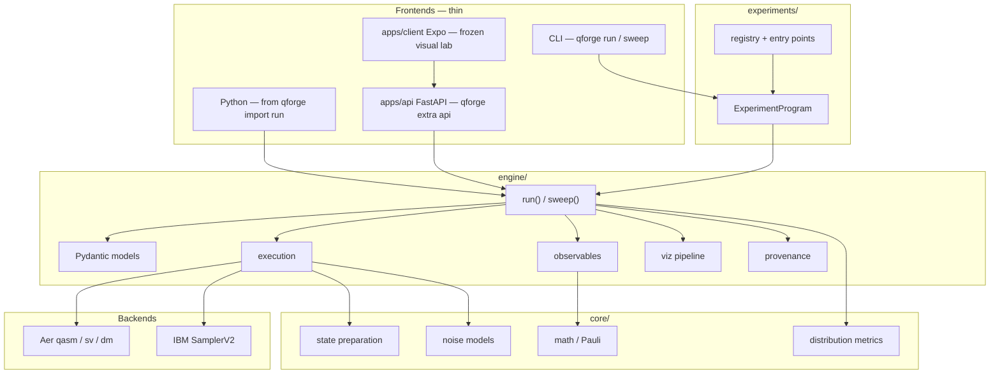

# QForge

[](https://github.com/RDOToole89/qforge/actions/workflows/ci.yml)
[](LICENSE)
[](https://www.python.org/downloads/)

**A general-purpose quantum experiment engine built on Qiskit — for learning, tinkering, and real hardware.**

The product is Python: `from qforge import run` and `qforge run`. You pick a state, optional noise, a simulation mode (or IBM Quantum), and an analysis layer for the question you are asking. The engine handles circuit construction, execution, measurement canonicalization, provenance, and typed results.

The 15-minute path is [docs/guides/getting-started/first-run.md](docs/guides/getting-started/first-run.md). You do not need the visual lab.

## Table of Contents

- [What Makes This Different](#what-makes-this-different)
- [Architecture](#architecture)
- [Features at a Glance](#features-at-a-glance)
- [Quick Start](#quick-start)
- [Learning Path](#learning-path)
- [Experiments](#experiments)
- [Tech Stack](#tech-stack)
- [Contributing](#contributing)
- [License](#license)

I'm a software engineer, not a physicist. I fell in love with quantum mechanics as a kid watching BBC science programs — Schrodinger's cat completely blew my mind. When I asked my teacher about it, she said: *"We're not discussing that in this class."* I never ended up in physics.

About eight years ago, stuck in the Australian outback on a working-holiday visa — isolated from the world for three months with nothing but an internet connection — I started watching physics lectures from the Royal Institution. Sean Carroll's clarity and elegance in explaining physics was addictive. I fell in love with the topic all over again and went deep: thousands of hours of lectures and videos from all kinds of thinkers.

Eventually, watching wasn't enough — I wanted to experiment. So I built a general-purpose framework to explore quantum computing hands-on.

The core idea is simple: **abstract away the hard parts of quantum experimentation**. You pick a quantum state, choose a noise model, configure a simulation (or point it at real hardware), and hit run. Results come back as Pydantic models with provenance, metrics with confidence intervals, and schema-compliant output you can analyze programmatically.

I'm open-sourcing it because I believe quantum computing should be accessible to anyone willing to tinker — you don't need a physics PhD to set up an experiment or see how noise shapes entanglement. I hope this framework helps spark that curiosity in others the way Sean Carroll's lectures sparked it in me.

---

## What Makes This Different

Most quantum computing tools are either toy tutorials or impenetrable research code. This framework tries to be the bridge:

- **One `run()` / `sweep()`** — named states, custom circuits, noise, shots, metrics, Pauli observables. Same config locally or on IBM (`sim_mode="hardware"`).
- **Analysis matches the question** — registered experiments pick a metric list (Asymmetry Index for a coin-flip qubit, Structure Score for Bell). You can also pass `metrics="structure"` or an explicit list when you call `run()` yourself.
- **Engine estimates; programs interpret** — `observables=` returns ⟨P⟩. VQE turns those into an H₂ energy; QAOA into a MaxCut cost. Core has no Hamiltonian type and no energy metric.
- **Pluggable experiments** — 49 in-tree programs, plus `register_experiment()` / entry points so a new track does not require editing the registry.

---

## Architecture

Three layers. The engine does not know what an experiment *means*. Core is not tied to any topic.



- `src/qforge/core/` — pure physics and statistics
- `src/qforge/engine/` — orchestration, no experiment-topic knowledge
- `src/qforge/experiments/` — pluggable programs
- `apps/` — consumers. FastAPI is `qforge[api]`. The Expo app talks HTTP; it is not required to use the engine.

See [docs/architecture/architecture.md](docs/architecture/architecture.md) and [docs/architecture/engine.md](docs/architecture/engine.md).

---

## Features at a Glance

| | |
|---|---|
| **State types** | GHZ, W, Bell, Cluster, Superposition, Custom (gate list, OpenQASM file, or a Python `QuantumCircuit`) |
| **Noise models** | Depolarizing, amplitude damping, phase damping, bit flip, phase flip, thermal relaxation, correlated depolarizing, readout error |
| **Simulation modes** | `qasm` (shot-based), `statevector` (exact), `density_matrix` (mixed state), `hardware` (IBM Quantum) |
| **Metrics** | Information-theoretic measures of outcome distributions, bootstrap 95% CIs, named profiles (`structure`, `quick`, `information_theory`) |
| **Observables** | Pauli strings (MSB-left). Engine returns ⟨P⟩; programs interpret |
| **Experiments** | 49 programs: basics, advanced (incl. VQE / QAOA), decoherence, hardware |
| **Hardware** | IBM Quantum via SamplerV2, auto-backend selection, transpilation capture, calibration snapshots |
| **Provenance** | Git SHA, software versions, host info, execution time |
| **CLI** | `qforge list` / `qforge run <experiment>` / `qforge run-config <file>` / `qforge sweep` |
| **HTTP** | Optional. `uv sync --extra api` then FastAPI over the same `run()` / `sweep()` |
| **Tests** | ~1,100 tests; physics/math core behind a 95% coverage gate |

### Visual lab (optional, frozen)

`apps/client` is an Expo teaching UI (Bloch sphere, circuit builder, glossary, configurator). It is **not** the product, and the circuit builder does **not** submit drawings to IBM — that path is not wired. New visual-lab work is parked; see `apps/AGENTS.md`. Use the engine.

---

## Quick Start

Walkthrough (superposition → Bell → noisy GHZ):
[docs/guides/getting-started/first-run.md](docs/guides/getting-started/first-run.md).

CLI reference: [docs/reference/cli.md](docs/reference/cli.md).

Until QForge is on PyPI, install from a clone. The name `qforge` on PyPI is already a different project.

```bash
git clone https://github.com/RDOToole89/qforge.git
cd qforge

# Install uv once (https://docs.astral.sh/uv/), then:
uv sync              # engine + CLI + dev/test
# uv sync --extra api  # only if you need apps/api

uv run qforge list
uv run qforge run 01_superposition
uv run qforge run 05_bell_states
uv run qforge run 06_ghz_states -s noise_enabled=true -s noise_type=depolarizing -s error_rate=0.05
```

`uv` installs the pinned Python 3.12 from `.python-version` and the lockfile environment. `uv run` uses that environment. CI also tests 3.11 and 3.13.

### Engine API

```python
from qforge import run, ExperimentConfig

result = run(ExperimentConfig(
    num_qubits=4,
    state_type="GHZ",
    shots=4096,
    noise_enabled=True,
    noise_type="depolarizing",
    error_rate=0.05,
    metrics="structure",
))

print(f"Fidelity: {result.analysis.measurement_results.fidelity:.4f}")
for name, m in result.metrics_bundle.metrics.items():
    print(f"  {name}: {m.value:.4f}")
```

### Real hardware

```python
result = run(ExperimentConfig(
    num_qubits=6,
    state_type="GHZ",
    sim_mode="hardware",
    shots=8192,
    metrics="structure",
))

print(f"Backend: {result.provenance.simulator_info['backend_name']}")
print(f"Job ID: {result.provenance.simulator_info['job_id']}")
```

See [Hardware Setup](docs/guides/hardware-setup.md) for IBM Quantum credentials.

---

## Learning Path

```
Start here                      Go deeper                        Study noise
    │                               │                                │
    ▼                               ▼                                ▼
┌──────────┐                 ┌──────────────┐                ┌──────────────┐
│ basics/  │                 │  advanced/   │                │ decoherence/ │
│          │                 │              │                │              │
│ Bell     │    ────────►    │ Shor's       │   ────────►    │ Topology     │
│ GHZ      │                 │ Grover's     │                │ Scaling      │
│ Noise    │                 │ Teleportation│                │ Noise sweep  │
│ Compare  │                 │ VQE / QAOA   │                │ State probe  │
└──────────┘                 └──────────────┘                └──────────────┘
                                                                     │
                                                                     ▼
                                                             ┌──────────────┐
                                                             │  hardware/   │
                                                             │              │
                                                             │ IBM Quantum  │
                                                             │ 3 backends   │
                                                             │ Provenance   │
                                                             └──────────────┘
```

**New to quantum?** Take the [first 15 minutes](docs/guides/getting-started/first-run.md), then the 11 `basics/` steps. Each experiment prints the metrics that match its question, plus a one-line hint.

**Know quantum, want to experiment?** Jump to `decoherence/` or add a program with `register_experiment()`. See [src/qforge/experiments/AGENTS.md](src/qforge/experiments/AGENTS.md).

**Want real hardware?** [Hardware setup](docs/guides/hardware-setup.md). One field: `sim_mode="hardware"`.

---

## Experiments

### Basics — 11-Step Learning Path

| Step | Experiment | What it teaches |
|------|-----------|----------------|
| 1 | `01_superposition` | Superposition: `qforge run` measures `|+⟩` (~50/50) |
| 2 | `02_measurement` | Probability, collapse, and the Born rule |
| 3 | `03_single_gates` | X, H, Z, Y, S, T — what each gate does |
| 4 | `04_two_qubits` | Independent vs entangled — the CNOT gate |
| 5 | `05_bell_states` | Bell Φ+: only `00` and `11` |
| 6 | `06_ghz_states` | 3-qubit GHZ; sweep `num_qubits` to scale |
| 7 | `07_w_states` | Distributed excitation — a different topology |
| 8 | `08_cluster_states` | Nearest-neighbor entanglement, invisible in Z-basis |
| 9 | `09_noise_intro` | What noise does to a qubit |
| 10 | `10_noise_types` | Five noise models compared on the same state |
| 11 | `11_noise_and_entanglement` | How entanglement changes error patterns |

### Advanced (classic algorithms)

| Experiment | What it teaches |
|-----------|----------------|
| `shor` | Factor integers with quantum period-finding |
| `grover` | Search with quadratic speedup via amplitude amplification |
| `teleportation` | Transfer a state using entanglement + classical bits |
| `vqe` | 2-qubit H₂ Pauli sum via `observables=`; energy is program extras, not a core metric |
| `qaoa` | MaxCut ⟨C⟩ from one ⟨ZZ⟩ per edge |

### Decoherence — 6-Step Noise Study Path

| Step | Experiment | What it explores |
|------|-----------|--------------|
| 1 | `dec_01_structured_vs_uniform` | Do errors spread uniformly, or concentrate on certain outcomes? |
| 2 | `dec_02_topology_matters` | Four entanglement topologies compared under the same noise |
| 3 | `dec_03_scaling` | How error patterns change with qubit count |
| 4 | `dec_04_noise_resilience` | Error patterns under increasing noise strength |
| 5 | `dec_05_global_vs_local` | Global (GHZ) vs local (W) entanglement under noise |
| 6 | `dec_06_simulation_vs_reality` | Where do noise models break down? |

### Hardware — 5-Step Path to Real Quantum Processors

| Step | Experiment | What it teaches |
|------|-----------|----------------|
| 1 | `hw_01_first_hardware_run` | Your first real quantum computer |
| 2 | `hw_02_hardware_vs_simulation` | Same circuit, hardware vs simulation |
| 3 | `hw_03_transpilation` | See your logical circuit become physical gates |
| 4 | `hw_04_backend_exploration` | Compare processors — is your result chip-independent? |
| 5 | `hw_05_real_decoherence` | Compare noisy-simulator error patterns with real-device decoherence |

Requires IBM Quantum credentials. See [docs/guides/hardware-setup.md](docs/guides/hardware-setup.md).

---

## Tech Stack

| Layer | Technology |
|-------|-----------|
| Quantum simulation | Qiskit 2.1, Qiskit Aer 0.17 |
| Hardware execution | Qiskit IBM Runtime (SamplerV2) |
| Engine | Python 3.11+, Pydantic 2, NumPy (dev pin 3.12) |
| CLI | Typer |
| HTTP (optional) | FastAPI, Uvicorn — `qforge[api]` |
| Visual lab (frozen) | React Native / Expo, TypeScript, Three.js |
| Code quality | ruff, mypy (strict), pytest (~1,100 tests), pre-commit hooks |

---

## Contributing

Contributions, ideas, and feedback are welcome. Especially useful:

- **Physics and math review** — I'm a software engineer learning quantum mechanics. If you spot errors in the physics, metric definitions, or circuit constructions, please open an issue. Correctness matters more than features.
- **New experiment programs** — Entanglement witnesses, error correction, variational algorithms, hardware benchmarking — anything that fits prepare → measure → analyze. Out-of-tree programs use `register_experiment()`; you do not have to edit the in-tree registry.
- **Documentation** — The 15-minute path, examples, and hardware setup.

The visual lab is frozen. Do not send frontend feature PRs until that freeze lifts (`apps/AGENTS.md`).

See [CONTRIBUTING.md](CONTRIBUTING.md) for the development workflow.

---

## About

I built this alongside my full-time job because quantum mechanics is endlessly fascinating and I wanted tools that let me explore it hands-on. I hope this framework helps spark interest in quantum computing for people who, like me, don't have physics PhDs but are curious enough to start tinkering.

The best way to learn quantum mechanics is to build something with it. This engine is meant to make that easy — from your first Bell state to a run on real hardware.

If you find it useful, interesting, or have ideas for making it better, I'd love to hear from you.

---

## License

Apache-2.0. See [LICENSE](LICENSE) for details.
