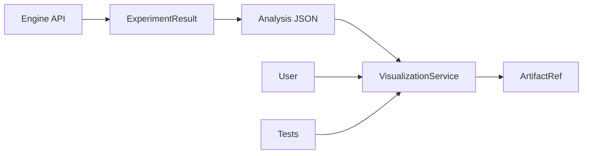

# Visualization Architecture - Engine Integration

## Current State & Integration Analysis

### How Viz Service Ties Into Engine

**Current Integration Level: MINIMAL/ISOLATED**

The visualization system is currently **loosely coupled** to the engine:



### Integration Points

1. **Engine Models** (`src/engine/models/config.py`)
   ```python
   visualization_type: Literal[
       "histogram",      # ✅ Working
       "density_matrix", # ❌ Broken
       "research",       # ❌ Broken  
       "plot",           # ❌ Unclear
       "none"           # ✅ Working
   ]
   ```

2. **Engine API** (`src/engine/api.py`)
   - **Currently**: NO direct visualization integration
   - **Result**: Engine creates analysis JSON, visualization is separate step

3. **Viz Service** (`src/engine/viz_service.py`)
   - **Status**: Standalone service, not called by engine
   - **Usage**: Manual instantiation for post-processing
   - **Output**: ArtifactRef pointing to saved plots

### Current Problems 🚨

1. **Broken References**
   - `density_matrix` → References deleted modules
   - `hypergraph` → References deleted modules  
   - `research` → Unclear what this does

2. **Overcomplexity**
   - 334 lines for simple histogram plotting
   - Multiple backend switching (matplotlib/plotly)
   - Complex path inference logic
   - Fallback chains everywhere

3. **Poor Integration**
   - Engine doesn't automatically generate visualizations
   - User must manually call viz service
   - No integration with research metrics

4. **Research Mismatch** 
   - Built for generic quantum experiments
   - Not optimized for structured decoherence research
   - Missing pathway analysis visualizations

## Proposed Architecture (Research-Focused)

### Simple, Extensible Design

```python
class ResearchVisualizationService:
    """Research-focused visualization for structured decoherence studies."""
    
    def render_pathway_histogram(self, result: ExperimentResult) -> ArtifactRef:
        """Histogram with pathway analysis annotations."""
        
    def render_metrics_comparison(self, results: List[ExperimentResult]) -> ArtifactRef:
        """Compare AI, PCR, EEC across experiments."""
        
    def render_threshold_study(self, sweep_results: List[ExperimentResult]) -> ArtifactRef:
        """Visualize pathway emergence vs system size."""
```

### Integration Options

**Option 1: Post-Processing (Current)**
```python
# User workflow
result = run(config)
viz = ResearchVisualizationService()
artifact = viz.render_pathway_histogram(result)
```

**Option 2: Engine Integration (Automatic)**
```python
# Engine workflow
config = ExperimentConfig(
    enable_research_metrics=True,
    auto_generate_plots=True  # New flag
)
result = run(config)
# result.artifacts includes visualizations automatically
```

**Option 3: Hybrid (Best of Both)**
```python
# Automatic for research, manual for custom
config = ExperimentConfig(enable_research_metrics=True)
result = run(config)  # Auto-generates standard research plots

# Manual for custom analysis
viz = ResearchVisualizationService()
custom_plot = viz.render_custom_analysis(result, analysis_type="topology_comparison")
```

### File Organization (Proposed)

```
src/engine/
├── api.py                    # Main engine entry points
├── models/                   # Pydantic models
├── analysis/                 # Research metrics integration
└── visualization/            # Research viz (NEW, simplified)
    ├── __init__.py
    ├── service.py           # ResearchVisualizationService
    ├── pathway_plots.py     # Structured decoherence specific
    └── research_plots.py    # AI, PCR, EEC visualizations
```

## Implementation Recommendations

### Phase 1: Cleanup Current Mess
1. **Delete broken viz types** (`density_matrix`, `hypergraph`)
2. **Simplify VisualizationService** to ~50 lines
3. **Fix histogram rendering** to work reliably
4. **Remove complex backend switching**

### Phase 2: Research Integration  
1. **Add research-specific plots** (pathway analysis, metrics comparison)
2. **Integrate with structured decoherence metrics**
3. **Add auto-generation option** to engine API

### Phase 3: Advanced Research Viz
1. **Threshold study visualizations** (pathway emergence vs complexity)
2. **Noise model comparisons** (pathway differences across noise types)
3. **Publication-ready plots** with research annotations

## Benefits of Cleanup

**Before (334 lines)**:
- ❌ Broken density matrix and hypergraph
- ❌ Complex backend switching
- ❌ Not research-focused
- ❌ Poor engine integration

**After (~80 lines)**:
- ✅ Simple, working histogram
- ✅ Research-focused extensibility
- ✅ Clean engine integration options
- ✅ Built for structured decoherence studies

## Questions for Decision

1. **Integration Level**: Post-processing vs automatic vs hybrid?
2. **Visualization Scope**: Just histograms vs full research suite?
3. **Engine Coupling**: Tight integration vs loose coupling?
4. **Extensibility**: Simple service vs plugin architecture?

The current viz system is **over-engineered for generic use** but **under-optimized for research**. A focused rewrite will be much more valuable for your structured decoherence studies! 🎯