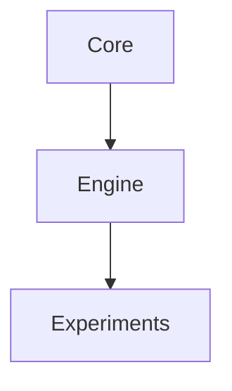

# AGENTS.md — Documentation Guidelines

Owner: Research Engineering (Roibín O'Toole)
Last updated: 2025-12-02
Token budget: 350

## Purpose

This layer contains all human-readable and AI-readable documentation. It ensures that the framework is understandable, maintainable, and usable by both current and future collaborators (human and AI).

## Structure

```
docs/
├── ai-context/           # AI collaboration context
│   ├── AI_COLLABORATOR_NOTES.md   # Why this framework matters
│   └── AI_DOC_STRATEGY.md         # Documentation philosophy
├── architecture/         # System design documents
│   ├── ARCHITECTURE.md
│   ├── ARCHITECTURE_AND_CAPABILITIES.md
│   ├── ENGINE_FIRST_REFACTOR_PLAN.md
│   └── FRAMEWORK_INTEGRATION.md
├── guides/              # User-facing documentation
│   ├── api/            # API reference
│   └── getting-started/ # Tutorials
├── planning/           # Roadmaps and future work
│   └── ROADMAP_TO_AAA.md
├── research-docs/      # Scientific theory and SST
│   ├── RESEARCH_PLAN.md
│   └── sst-ext.md
└── index.md           # Documentation home
```

## Documentation Types

### AI-Context Docs (`ai-context/`)

**Purpose**: Help AI agents understand the framework's philosophy and constraints.

**Constraints**:

- Short, structural, constraint-focused
- No narrative or explanations
- Focus on rules, boundaries, allowed imports
- Token-efficient (200–600 tokens)

**Files**:

- `AI_COLLABORATOR_NOTES.md` — Why this framework matters (scientific context)
- `AI_DOC_STRATEGY.md` — Documentation philosophy (meta-documentation)

### Architecture Docs (`architecture/`)

**Purpose**: Explain system design, refactor plans, and integration patterns.

**Constraints**:

- Technical and detailed
- Diagrams encouraged (Mermaid, ASCII art)
- Include rationale and trade-offs
- Reference specific files and modules

**Files**:

- `ARCHITECTURE.md` — Overall system design
- `ENGINE_FIRST_REFACTOR_PLAN.md` — Refactor strategy
- `FRAMEWORK_INTEGRATION.md` — How layers integrate

### User Guides (`guides/`)

**Purpose**: Help users get started and use the framework effectively.

**Constraints**:

- Step-by-step instructions
- Code examples that work out-of-the-box
- Screenshots/outputs where helpful
- Clear prerequisites and setup steps

**Files**:

- `getting-started/installation.md` — Setup instructions
- `api/metrics.md` — API reference for metrics
- `api/constants.md` — Configuration constants

### Research Docs (`research-docs/`)

**Purpose**: Document the scientific theory and research questions.

**Constraints**:

- Long-form narrative allowed
- Cite papers and theories
- Explain physics and SST philosophy
- Connect to code implementations

**Files**:

- `sst-ext.md` — Structured Substrate Thesis (SST) philosophy
- `RESEARCH_PLAN.md` — Research roadmap and hypotheses

### Planning Docs (`planning/`)

**Purpose**: Track future work, roadmaps, and feature planning.

**Constraints**:

- High-level goals
- Prioritized task lists
- Milestones and timelines
- Link to GitHub issues/PRs where relevant

**Files**:

- `ROADMAP_TO_AAA.md` — Future development plans

## Do Not

- **Mix AI docs with human docs** — Keep them in separate folders
- **Duplicate information** — Link to canonical sources
- **Embed code in docs** — Link to actual files instead
- **Use complex formatting** — Stick to standard Markdown
- **Create orphan docs** — Link from `index.md` or other docs
- **Skip metadata** — Always include Owner, Last updated
- **Use absolute paths** — Use relative paths for cross-references

## Always

- **Update docs in the same PR** — Documentation changes with code changes
- **Use proper Markdown** — Headers, lists, code blocks, tables
- **Include code examples** — Show, don't just tell
- **Link to related files** — Connect docs to implementation
- **Use consistent voice** — Technical but accessible
- **Add diagrams** — Visual aids for complex concepts
- **Keep AI docs token-efficient** — Brevity is key

## Markdown Standards

### Headers

```markdown
# H1 — Document Title
## H2 — Major Section
### H3 — Subsection
#### H4 — Rare, for nested content
```

### Code Blocks

```markdown
```python
# Always specify language
def example():
    pass
```
```

### Links

```markdown
[Relative link](../architecture/ARCHITECTURE.md)
[External link](https://qiskit.org)
```

### Lists

```markdown
- Unordered list
- Item 2
  - Nested item

1. Ordered list
2. Item 2
```

### Tables

```markdown
| Column 1 | Column 2 |
| :------- | :------- |
| Data     | Data     |
```

### Diagrams (Mermaid)

```markdown

```

## File Naming

- Use `SCREAMING_SNAKE_CASE.md` for important docs (e.g., `README.md`, `ARCHITECTURE.md`)
- Use `kebab-case.md` for guides (e.g., `installation.md`, `api-reference.md`)
- Use descriptive names (not `doc1.md`, `notes.md`)

## Cross-Referencing

Link to implementation:

```markdown
See canonical implementation in `src/core/state_preparation/factory.py`.
```

Link to related docs:

```markdown
For more details, see [Architecture Overview](../architecture/ARCHITECTURE.md).
```

## Updating Documentation

1. **Code changes** → Update relevant docs in same PR
2. **New features** → Add to `guides/api/` or `guides/getting-started/`
3. **Architecture changes** → Update `architecture/*.md`
4. **Research findings** → Update `research-docs/*.md`
5. **AI boundaries** → Update `AGENTS.md` files in affected modules

## Maintenance Schedule

- **After each PR**: Update affected docs
- **Monthly**: Review and update `planning/ROADMAP_TO_AAA.md`
- **Quarterly**: Full doc audit for accuracy
- **Before releases**: Ensure `guides/` are up-to-date

## Examples

See canonical documentation:

- `docs/ai-context/AI_DOC_STRATEGY.md` — Meta-documentation
- `docs/architecture/ARCHITECTURE.md` — Technical design doc
- `docs/guides/getting-started/installation.md` — User guide
- `docs/research-docs/sst-ext.md` — Scientific theory doc
