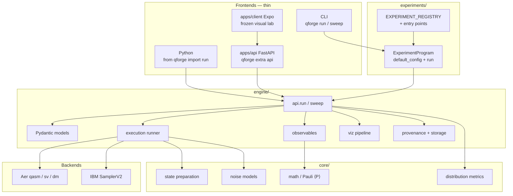
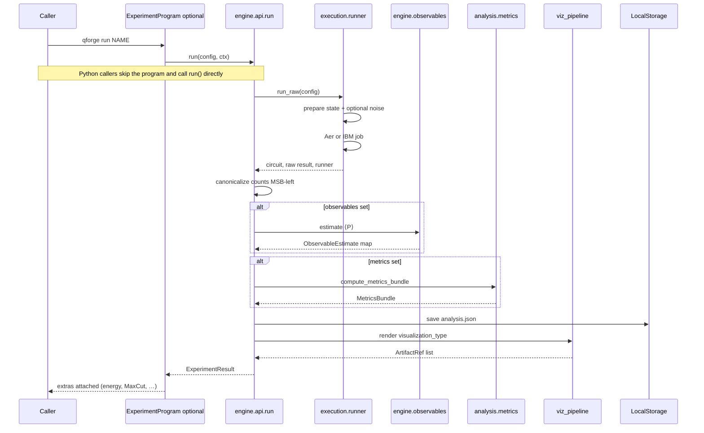
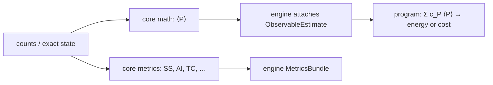
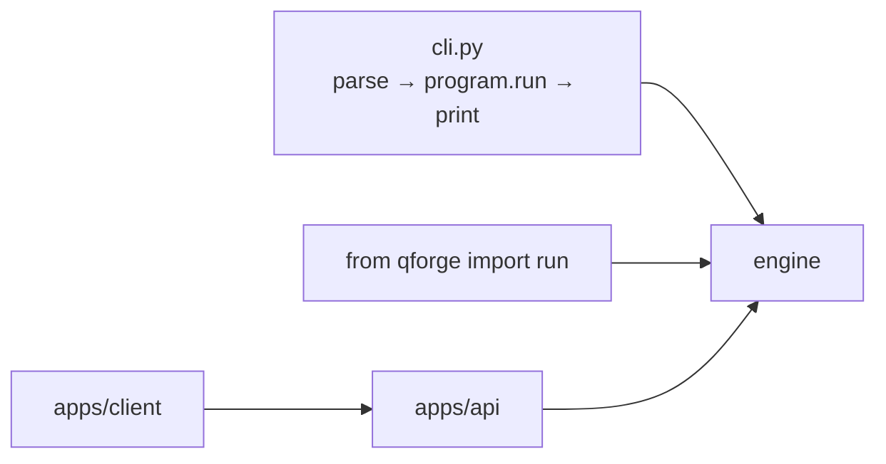

# Architecture

QForge is a general-purpose quantum experiment engine. Frontends (CLI, Python
`run()`, FastAPI, the visual lab) are thin. They call the same two functions:
`run()` and `sweep()`.

The visual lab is optional and currently frozen. The 15-minute path is
[First 15 minutes](../guides/getting-started/first-run.md).

## Layers



**Dependency rules**

- `core/` must not import `engine/` or `experiments/`
- `engine/` must not import `experiments/`
- `experiments/` may import both
- `apps/` talks HTTP JSON; it does not import physics internals as a public API

**Key principle:** `core/` is pure physics and statistics. It has no chemistry,
no Hamiltonian type, and no energy metric. Pauli strings and ⟨P⟩ live here;
weighted sums and domain names (VQE energy, QAOA MaxCut) live in programs.
`engine/` orchestrates without knowing what an experiment *means*.

## What happens on one `run()`



Detail of each box: [Engine internals](engine.md).

## Configuration and results

`ExperimentConfig` (`src/qforge/engine/models/config.py`) is the typed input.
`ExperimentResult` is the typed output.

| Field | Purpose |
|-------|---------|
| `num_qubits`, `state_type` | GHZ, W, Bell, Cluster, Superposition, Custom |
| `sim_mode` | `qasm`, `statevector`, `density_matrix`, `hardware` |
| `noise_enabled`, `noise_type`, `error_rate` | Channel and strength |
| `shots`, `rng_seed` | Sampling and reproducibility |
| `metrics` | Profile name (`structure`, `quick`, `information_theory`) or an explicit list |
| `observables` | Pauli strings, MSB-left. Estimates are ⟨P⟩ ∈ [-1, 1], not an energy or a cost |
| `visualization_type` | Plots to save. `circuit` is Qiskit's `circuit.draw` (mpl PNG, text fallback) plus gate explainers. `none` skips plots |
| `experiment_type` | Optional free-string label for grouping — not a closed taxonomy |

`ExperimentResult` carries:

- `analysis` — circuit stats, counts, probabilities, fidelity, optional ⟨P⟩, optional statevector / density matrix
- program extras on the result (VQE: `h2_energy` / `h2_fci`; QAOA: `maxcut_cost` / `maxcut_optimal`) — **not** core metrics
- `metrics_bundle` — name → `{value, ci95, status, extras}`
- `provenance` — git SHA, versions, host, hardware job ids
- `artifacts` — saved analysis JSON and plots

## Observables vs metrics



Histogram metrics describe **outcome distributions**. Observables estimate
**Pauli strings**. Interpretation (energy, MaxCut, Grover success) stays in
`experiments/`. Do not add a Hamiltonian type or an energy metric to core.

## Experiments

Each program implements `ExperimentProgram`: `name`, `description`,
`default_config()`, `run(overrides)`. In-tree tracks:

- `basics/` — 11 steps + 10 deep dives
- `advanced/` — algorithms (Shor, Grover, VQE, QAOA, …)
- `decoherence/` — noise-structure track
- `hardware/` — IBM Quantum path

Out-of-tree: `register_experiment()` or setuptools entry points in group
`qforge.experiments`. Failed entries are skipped; builtins are not overwritten.

## Frontends



- **CLI** — no domain decisions. See [CLI reference](../reference/cli.md).
- **FastAPI** — `qforge[api]` / `uv sync --extra api`. Not part of the engine install.
- **Expo client** — visual lab; freeze in `apps/AGENTS.md`.

## Execution backends

| `sim_mode` | Backend | What you get |
|------------|---------|--------------|
| `qasm` | AerSimulator | Shot counts, optional noise |
| `statevector` | AerSimulator | Exact noiseless amplitudes (+ synthesized counts) |
| `density_matrix` | AerSimulator | Mixed state under noise |
| `hardware` | IBM SamplerV2 | Device counts, transpilation, calibration |

## Reproducibility

- `rng_seed` through simulation and bootstrap
- Canonical MSB-left bitstrings (logical index 0 = leftmost character)
- Provenance on every result
- Versioned analysis JSON under `results/`

## Module map

```
src/qforge/engine/
├── api.py               run(), sweep(), iter_experiment_configs()
├── observables.py       extra X/Y circuits; math is core
├── bloch_math.py        Bloch coordinates for visualization
├── fidelity.py          statevector / density matrix / fidelity
├── provenance.py
├── viz_pipeline.py
├── analysis/metrics.py  registry → MetricsBundle
├── execution/           Aer + IBM
├── models/              Pydantic
├── persistence/
└── visualization/       Qiskit circuit.draw + plots

src/qforge/core/
├── state_preparation/
├── noise_models/
├── math/                Paulis, ⟨P⟩, indexing, distances, rates
└── analysis/            metrics, bootstrap, null models
```
