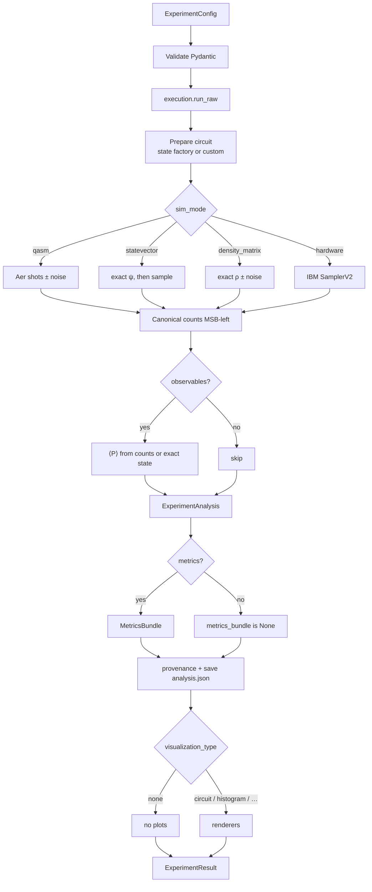

# Engine

This is how `src/qforge/engine/` turns an `ExperimentConfig` into an
`ExperimentResult`. Callers are the CLI, `from qforge import run`, or
`apps/api`. The engine does not know experiment topics.

Public imports:

```python
from qforge import ExperimentConfig, ExperimentResult, SweepManifest, run, sweep
```

## `run()` — one experiment



Implementation: `src/qforge/engine/api.py`. Circuit build and backend dispatch:
`src/qforge/engine/execution/runner.py`.

### 1. Config

`ExperimentConfig` is the single input object. Important fields are listed in
[Architecture](architecture.md). Custom circuits use `state_type="CUSTOM"` and
`custom_params={"source": "circuit", "circuit": qc}`.

### 2. Execute

The runner:

1. Builds or accepts a `QuantumCircuit`
2. Applies a noise model when `noise_enabled` (not in `statevector` mode)
3. Dispatches on `sim_mode`
4. Returns `(circuit, raw, runner)` so extra Pauli circuits can replay the same
   backend, shots, seed, and noise

`execute_circuit()` is a thin replay. Extra X/Y measurement circuits are built
in `engine/observables.py`, not in the runner.

### 3. Counts

Measurement bitstrings are canonicalized **MSB-left**: `bitstring[0]` is logical
qubit 0 (Qiskit physical qubit `n-1`). All analysis and Pauli labels use that
convention. See `src/qforge/core/math/indexing.py`.

### 4. Observables

If `observables=["ZZ", "XX", …]`:

- `statevector` / `density_matrix` — exact ⟨P⟩ (`stderr` is `None`)
- `qasm` / `hardware` — I/Z reuse the Z-basis shots; X/Y run extra rotated
  circuits, grouped by measurement basis

Values land on `result.analysis.measurement_results.observables` as
`ObservableEstimate(pauli, value, stderr, shots)`.

Programs combine those numbers. VQE: \(E = \sum c_P \langle P\rangle\).
QAOA MaxCut: \(C = \sum_{\mathrm{edges}} (1 - \langle Z_i Z_j\rangle)/2\).
The engine never names those quantities.

### 5. Metrics

If `metrics` is a profile name or a list, the engine asks the core registry for
those keys and wraps them in a `MetricsBundle` (value, bootstrap `ci95`, status).

Built-in profiles: `structure`, `quick`, `information_theory`. Teaching
experiments usually pass an **explicit list** so extra-input metrics (CES,
pathway persistence) are not printed empty on a single run.

### 6. Provenance and storage

Every result records git SHA, package versions, host, runtime, and hardware job
ids when relevant. Analysis JSON is written under `results/` (override with
`--results-dir` / `AppContext`).

### 7. Visualization

`visualization_type` is a string or list:

| Value | What it saves |
|-------|----------------|
| `histogram` | Outcome histogram (engine default) |
| `circuit` | Qiskit `circuit.draw` — mpl PNG when `pylatexenc` is installed, otherwise the text drawer. Unique-gate explainers go on the figure and the CLI |
| `density_matrix` | Heatmap when a density matrix exists |
| `metrics_summary` | Bar chart of computed metrics |
| `correlation` | EEC matrices when extras are present |
| `bloch_sphere` | 1–2 qubit Bloch data |
| `all` | Every type whose data exists |
| `none` | Persist analysis JSON only; no plots |

Turn circuit diagrams **off** with `-s visualization_type=none` or by omitting
`circuit` from the list. QAOA and VQE default to `["histogram", "circuit"]`.

Rendering is non-fatal: a failed plot is logged and the result still returns.

## `sweep()` — many configs

```python
from qforge import ExperimentConfig, SweepManifest, sweep

results = sweep(SweepManifest(
    base_config=ExperimentConfig(num_qubits=3, state_type="GHZ", shots=1024),
    parameter_ranges={"error_rate": [0.01, 0.05, 0.1]},
))
```

`iter_experiment_configs()` yields the cartesian product without executing.
The CLI `qforge sweep NAME -p key=v1,v2` builds a `SweepManifest` from the
experiment's default config.

There is **no variational optimizer** in the engine. A program that wants a
θ-loop calls `run()` itself (`vqe.run_theta_sweep()`, `qaoa.run_depth_sweep()`).

## Models

| Module | Role |
|--------|------|
| `models/config.py` | `ExperimentConfig` |
| `models/results.py` | `ExperimentResult` (`extra="allow"` so programs can attach fields) |
| `models/measurement.py` | counts, fidelity, `ObservableEstimate` |
| `models/analysis.py` | `MetricsBundle` / `MetricEntry` |
| `models/circuit.py` | depth, gate counts |
| `models/provenance.py` | versions, git, host |
| `models/sweep.py` | `SweepManifest` |
| `models/storage.py` | `ArtifactRef` |

## Plugins without a plugin framework

- Metrics: `register()` / `register_profile()`
- Experiments: `register_experiment()` or setuptools group `qforge.experiments`

Discovery only. Failed entry points are logged and skipped. Names already in
`EXPERIMENT_REGISTRY` are not overwritten.

## What the engine will not grow into

- A chemistry / Hamiltonian layer
- A named `algorithms` metric profile for VQE energy or Grover success
- A plugin framework on top of entry points
- A variational optimizer loop
- The visual lab (frozen; see `apps/AGENTS.md`)
