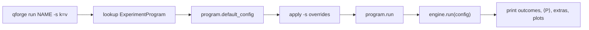

# CLI Reference

The `qforge` command is a thin wrapper: parse arguments, call
`ExperimentProgram.run()` or engine `sweep()`, print. It does not decide
physics. Prefix commands with `uv run` unless the project venv is active.

```bash
uv sync
uv run qforge --help
```

If you just cloned the repo, start with
[First 15 minutes](../guides/getting-started/first-run.md) instead of this page.

## How a command maps to the engine



`qforge run` always goes through the **experiment program**, so extras such as
`h2_energy` or `maxcut_cost` print. `qforge run-config` loads an
`ExperimentConfig` JSON and calls engine `run()` directly — no program extras.

## Global flags

These sit on `qforge` itself, before the subcommand:

| Flag | Default | Meaning |
|------|---------|---------|
| `-h`, `--help` | | Help |
| `--version` | | Package version |
| `-l`, `--log-level` | `WARNING` (or `QEF_LOG_LEVEL`) | `DEBUG`, `INFO`, `WARNING`, `ERROR` |
| `-q`, `--quiet` | off | Log level ERROR |
| `--results-dir` | `results/` (or `QEF_RESULTS_DIR`) | Where histograms and `analysis.json` go |

```bash
uv run qforge --version
uv run qforge --results-dir tmp/out run 01_superposition
```

## `qforge list`

Registered programs, grouped for display (basics / advanced / decoherence /
hardware / deep dives). Grouping is presentation only.

```bash
uv run qforge list
```

Out-of-tree programs appear here after `register_experiment()` or an installed
entry point in group `qforge.experiments`.

## `qforge run <name>`

Runs the program's **default config**, then applies `-s` overrides.

```bash
uv run qforge run <name> [-s KEY=VALUE]... [--json] [--results-dir DIR]
```

| Option | Meaning |
|--------|---------|
| `-s`, `--set KEY=VALUE` | Override one `ExperimentConfig` field. Repeatable. Values are JSON if they parse (`true`, `0.05`, `[...]`) otherwise strings |
| `-j`, `--json` | Full `ExperimentResult` JSON on stdout |

```bash
uv run qforge run 01_superposition
uv run qforge run 01_superposition -s shots=2048 -s rng_seed=42
uv run qforge run 06_ghz_states -s noise_enabled=true -s noise_type=depolarizing -s error_rate=0.05
uv run qforge run 01_superposition --json > result.json
```

### What prints

1. **Outcomes** — top shot bitstrings  
2. **Metrics** — if the experiment requested any, plus `metrics_hint`  
3. **Observables** — if `observables=` was set  
4. **Interpretation** — program extras (`h2_energy`, `maxcut_cost`, …)  
5. **Circuit** — Qiskit text draw + unique-gate explainers when circuit viz ran  
6. **Saved** — paths under `results/`

`qforge run` is one default. Extra methods (`run_all_states`, `run_theta_sweep`)
are Python-only.

### Visualization

| `-s visualization_type=…` | Effect |
|---------------------------|--------|
| `histogram` | Outcome histogram (engine default) |
| `circuit` | Qiskit `circuit.draw` (PNG via matplotlib/`pylatexenc`, else text) + gate explainers |
| `["histogram", "circuit"]` | Both (QAOA / VQE default) |
| `none` | Analysis JSON only; no plots |
| `all` | Every renderer whose data exists |

```bash
uv run qforge run qaoa
uv run qforge run qaoa -s visualization_type=circuit
uv run qforge run qaoa -s visualization_type=none
```

### Observables

```bash
uv run qforge run 05_bell_states -s "observables=[\"ZZ\",\"XX\",\"YY\"]"
```

On PowerShell, quoting JSON lists is awkward; use Python or a JSON file
(`run-config`) for lists. Named experiments that already set `observables`
(VQE, QAOA) need no extra flag.

## `qforge sweep <name>`

Cartesian product of `-p` ranges on top of the experiment default (and `-s`
overrides applied to every point).

```bash
uv run qforge sweep <name> -p KEY=v1,v2,v3 [-s KEY=VALUE]... [--json]
```

`-p` also accepts a JSON list: `-p "num_qubits=[2,3,4]"`.

```bash
uv run qforge sweep 06_ghz_states -p num_qubits=2,3,4 -s shots=1024
uv run qforge sweep 06_ghz_states -p error_rate=0.01,0.05,0.1 -s noise_enabled=true -s noise_type=depolarizing
uv run qforge sweep 06_ghz_states -p num_qubits=2,3 -p error_rate=0.01,0.05 -s noise_enabled=true -s noise_type=depolarizing
```

Prefer `sweep` over a shell loop when you want one table.

## `qforge run-config <path>`

Load a JSON `ExperimentConfig` and call engine `run()` — **not** a named
program. No VQE/QAOA extras.

```json
{
  "num_qubits": 4,
  "state_type": "GHZ",
  "noise_enabled": true,
  "noise_type": "depolarizing",
  "error_rate": 0.05,
  "shots": 4096,
  "metrics": "structure",
  "visualization_type": "histogram"
}
```

```bash
uv run qforge run-config my_experiment.json
uv run qforge run-config my_experiment.json --json > results.json
```

## `qforge sweep-config <path>`

JSON [SweepManifest](../guides/getting-started/quickstart.md): `base_config` plus
`parameter_ranges`.

```bash
uv run qforge sweep-config my_sweep.json
```

## `-s` keys

Any `ExperimentConfig` field works. Common ones:

| Parameter | Type | Notes |
|-----------|------|--------|
| `num_qubits` | int | |
| `state_type` | str | `GHZ`, `W`, `BELL`, `CLUSTER`, `SUPERPOSITION`, `CUSTOM` |
| `sim_mode` | str | `qasm`, `statevector`, `density_matrix`, `hardware` |
| `noise_enabled` | bool | |
| `noise_type` | str | e.g. `depolarizing`, `amplitude_damping` |
| `error_rate` | float | 0–1 |
| `shots` | int | |
| `rng_seed` | int | Reproducible shots / bootstrap |
| `metrics` | str or list | Profile or explicit names |
| `observables` | list of str | Pauli strings, MSB-left |
| `visualization_type` | str or list | See table above |
| `experiment_type` | str | Storage label only |
| `backend_name` | str | IBM backend when `sim_mode=hardware` |

Full field list: [Architecture](../architecture/architecture.md) and
`ExperimentConfig` in `src/qforge/engine/models/config.py`.

## Scripting

```bash
uv run qforge run 01_superposition --json | jq ".metrics_bundle.metrics.asymmetry_index.value"
uv run qforge run qaoa --json | jq ".maxcut_cost"
```

```bash
uv run qforge sweep 06_ghz_states -p error_rate=0.01,0.05,0.1 \
  -s noise_enabled=true -s noise_type=depolarizing --json
```

## Exit codes

- `0` — success  
- `1` — unknown experiment, invalid config, or execution failure  

Unknown names print close matches from the registry.

## Help

```bash
uv run qforge --help
uv run qforge run --help
uv run qforge sweep --help
uv run qforge run-config --help
uv run qforge sweep-config --help
uv run qforge list --help
```

Engine internals behind these commands: [Engine](../architecture/engine.md).
