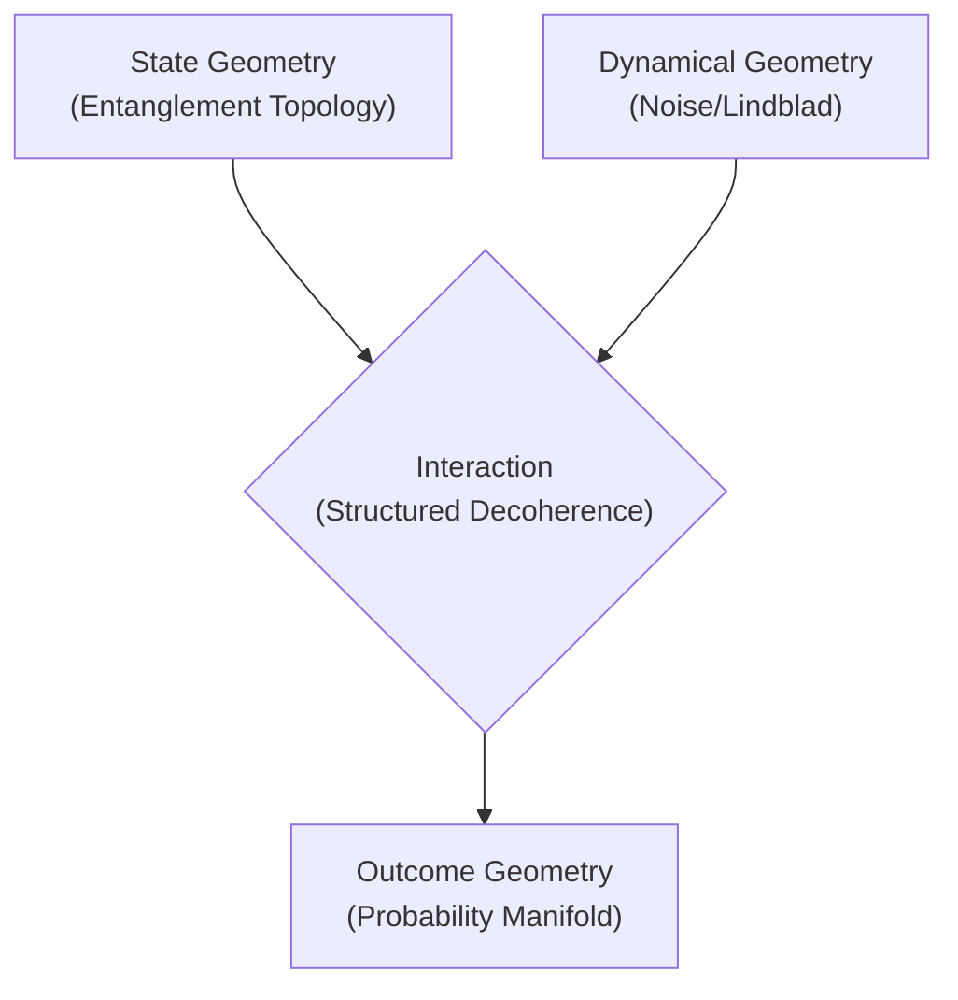
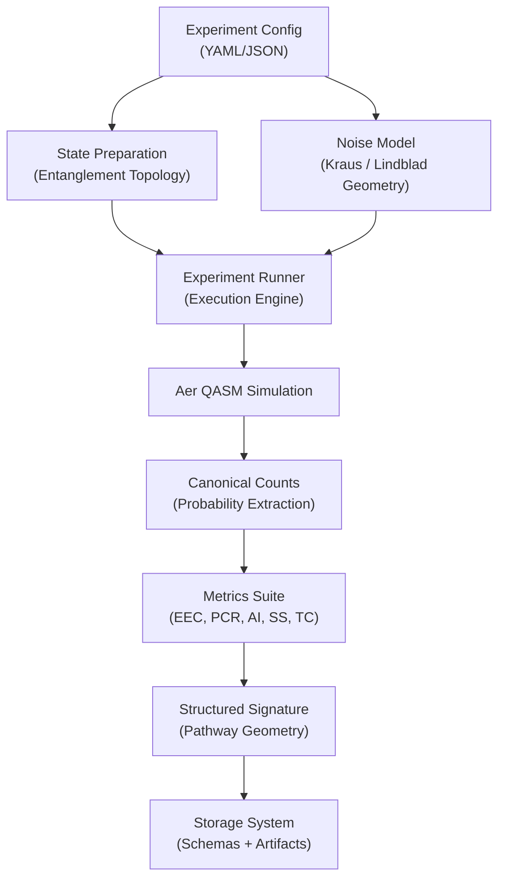
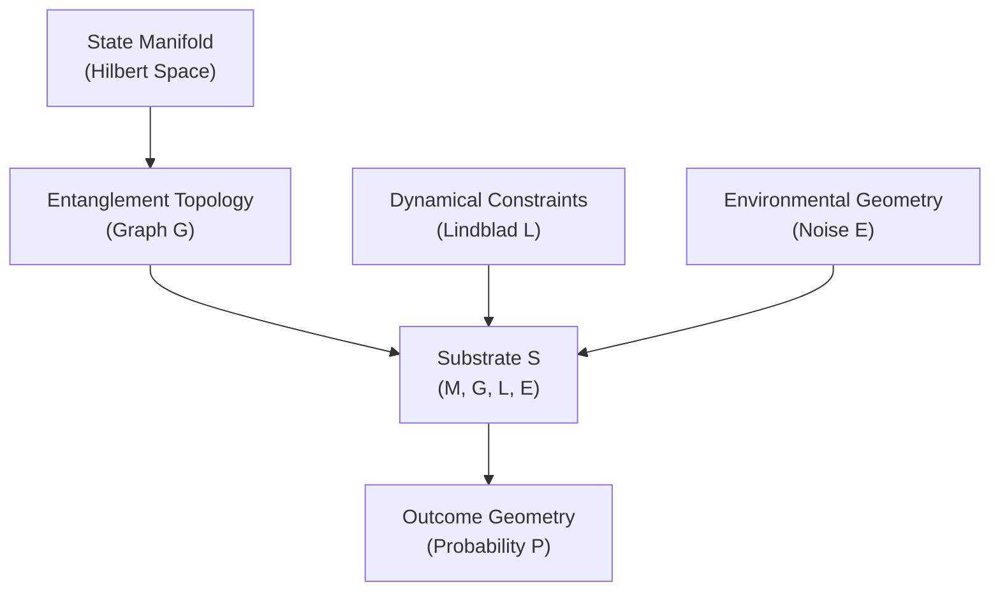
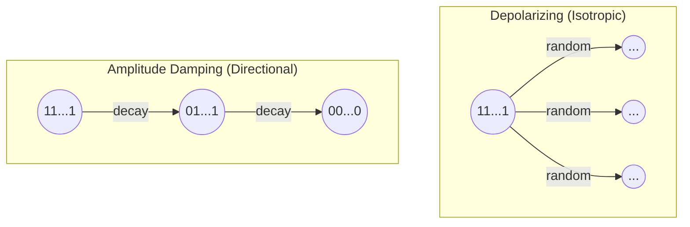
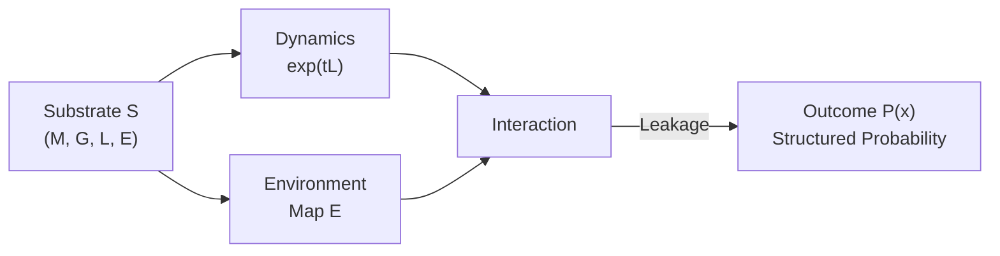
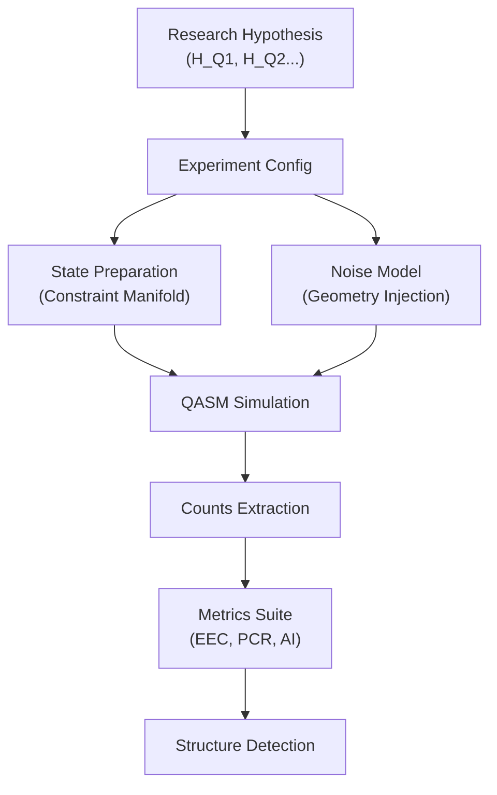

# Constraints as Causes: Toward a Structural Theory of Propagation in Quantum Mechanics and Adaptive Systems

**Roibín O’Toole — Software Engineer & Independent Researcher**
**Draft v0.1 — December 2025**

## Abstract

**Part I: Foundational Framework**

Across physics, biology, computation, and learning systems, one observes a recurring pattern: constraints act as causal structures. They shape the dynamical evolution of systems not by prescribing explicit step-by-step instructions, but by sculpting the space of allowable transformations.

In quantum mechanics, entanglement imposes global constraints on joint states. In biological morphogenesis, as shown by Michael Levin’s work, cellular collectives exhibit emergent intelligence constrained by electrical and biochemical networks. In computational systems, algorithms—whether Bubble Sort or modern neural architectures—display directed behavior not because they are “told” what to do but because their internal constraint networks guide the flow of information.

This draft proposes a unifying direction: **Structured Substrate Theory (SST)**—the hypothesis that decoherence, computation, and adaptation across physical and artificial systems share a common geometry of constraint-driven propagation. Formally, SST aims to describe how dynamics unfold within a constraint manifold, how information “leaks” beyond it during decoherence, and how structure governs these transitions.

The work draws inspiration from David Deutsch’s constructor theory, Penrose’s geometric worldview, Wolfram’s computational irreducibility, Hofstadter’s recursive architectures, and Max Tegmark’s geometric thinking. It is written from the perspective of a software engineer whose background is in computation but whose research interests cross physics and philosophy. This draft reports early formalizations, intuitive models, and initial quantitative evidence produced through the author’s custom Qiskit Experiment Framework, designed to study structured decoherence pathways.

This is a conceptual and mathematical work in progress. The aim is not to assert a finished theory, but to articulate a direction, provide formal definitions where possible, highlight open problems, and build the mathematical vocabulary required for future refinement.

*Note: This document serves as Part I of the research program, establishing the theoretical framework and computational architecture. Detailed experimental results and predictive demonstrations will appear in Part II.*

---

## 1. Introduction

### 1.1 Motivating Intuition

Many modern scientific advances point toward a common theme: systems do not evolve freely—they evolve through constraints.

- **Entanglement** couples degrees of freedom into a shared state space.
- **Noise channels** impose geometric transformations on density matrices.
- **Algorithms** operate by constraining trajectories in state space.
- **Biological collectives** move toward target morphologies via constraint networks rather than central control.
- **Learning systems** shape gradients through architectural constraints, not prescriptive instructions.

The central intuition is simple:

> **Constraints have causal force.** They are not passive boundaries—they determine the geometry through which dynamics propagate.

From this viewpoint, decoherence is not merely random collapse; it is the interaction between a structured entanglement topology and the structured geometry of environmental noise. The interference between these two constraint structures produces predictable pathways in the observed distribution of measurement outcomes.

### 1.2 Why This Matters

In every domain where information flows through structure—quantum systems, learning architectures, biological tissues—there exists a tension:

1. **Unitary evolution** or gradient descent or pattern completion describes how internal dynamics unfold.
2. **Noise**, perturbation, or environmental interaction introduce uncertainty.
3. **Constraint networks** determine which uncertainties matter and how they propagate.

This project aims to articulate a mathematical and conceptual framework capable of describing how constraint networks shape propagation across scales.

Formally:
- In **quantum systems**: How does entanglement topology interact with Kraus operators to produce structured decoherence?
- In **algorithms**: How do constraint-based architectures shape information flow?
- In **adaptive systems**: How do internal constraints regulate “morphological intelligence”?

Although these domains differ deeply in their mechanisms, their mathematics may share a common language.

### 1.3 Influences and Intellectual Lineage

This work stands at a crossroads of ideas:

- **David Deutsch**: Constructor theory and the view of laws as statements about possible and impossible transformations.
- **Chiara Marletto**: Counterfactuals and substrate-independent descriptions.
- **Stephen Wolfram**: Computation as fundamental, irreducibility, rule-guided behavior.
- **Roger Penrose**: Geometry as the core language of physics; constraints encoded in mathematical form.
- **Douglas Hofstadter**: Recursive structures, self-reference, and emergent intelligence.
- **Michael Levin**: Morphological computation and constraint-driven collective behavior in biological systems.
- **Max Tegmark**: Geometric representations and state manifolds.

The author does not claim to unify these perspectives; rather, their collective influence shapes the direction of inquiry.

### 1.4 The Problem This Draft Addresses

There are three interlocking problems:

1. **Formal Confusion**: In both physics and philosophy, one often blurs:
   - the geometry of the underlying physical system,
   - the topology of the prepared quantum state,
   - the structure of environmental noise,
   - the statistical structure of measurement outcomes.
   These must be mathematically distinguished.

2. **Decoherence as a Geometric Process**: Decoherence is usually treated as “loss of coherence,” but we can reinterpret it as: **topological leakage beyond the active constraint manifold.**

3. **Structural Propagation Across Domains**: Similar patterns appear in:
   - quantum decoherence,
   - biological morphogenesis,
   - neural network dynamics,
   - algorithmic computation,
   - evolutionary search.
   This raises the question: *Is there a general theory of constraint-driven propagation?*

This draft presents early formal definitions and an experimental framework that begins to quantify these ideas.

### 1.5 Scope of This Draft

This document is not a “new interpretation of quantum mechanics” nor a unified theory. It is:
- a working conceptual framework,
- with partial mathematical definitions,
- supported by initial quantitative experiments,
- seeking feedback from researchers,
- written in a style that reflects both philosophical curiosity and scientific rigor.

**Domain of Validity**
At present, SST is formulated for small to medium $n$-qubit systems and uses coarse-grained metrics (PCR, EEC, AI, TPS) rather than full manifold reconstruction, due to exponential state-space growth.

**Nature of the Work**
SST is not a rival interpretation of quantum mechanics; it is a structured research program for organizing experiments, metrics, and hypotheses around constraint geometry. This document is the theoretical and computational foundation of the SST research program. A separate results paper will report data, and a third paper will explore predictive topology-to-pathway laws.

### 1.6 Map of the Paper

Below is the structural outline:

1. **Foundations**: formal definitions of constraint geometry, substrate structure, Lindblad maps.
2. **SST**: the Structured Substrate Thesis—decoherence as guided leakage.
3. **Propagation Theory**: constraint-driven dynamics across domains.
4. **Experimental Work**: description of the author’s Qiskit-based framework.
5. **Results**: structured patterns in GHZ and W states under noise.
6. **Discussion**: interpretation, limitations, open problems.
7. **Appendix**: mathematical derivations, notation, references.

---

## 2. Why Constraints Matter: A Philosophical Prelude

Physics often proceeds by writing equations and letting dynamics unfold:
- Schrödinger equation
- Hamilton’s equations
- Maxwell’s equations
- Einstein’s field equations
- Gradient descent
- Logistic map
- Update rules in cellular automata

But these equations operate inside a space of allowable transformations.

> **What if the real causal force lies not in the dynamical rules, but in the structure of the space on which they act?**

For example:
- A **GHZ state** evolves within an entangled subspace with fixed symmetries.
- A **neural network** updates inside a manifold shaped by architecture, not weights.
- A **biological tissue** morphs through shape-space defined by adhesion networks.
- An **algorithm** “searches” a state space shaped by constraints, not by imperative logic.

In all these cases:
**Constraints shape the geometry of transformation. The dynamics merely flow along allowed channels.**

This is the central theme of the **Structured Substrate Theory**: that dynamics (unitary, dissipative, adaptive) inherit structure from constraint networks, and this structure manifests in measurable patterns.

---

## 3. Formal Foundations: What Is a “Constraint”?

The next sections build the mathematical vocabulary needed to make the earlier intuitions precise. We begin by separating three geometries that are frequently conflated:

1. **State Geometry** — the manifold on which the quantum state lives
2. **Dynamical Geometry** — the structure imposed by Hamiltonians & Kraus operators
3. **Outcome Geometry** — the structure of the measurement-induced probability distribution

These are tightly coupled but mathematically distinct.

### 3.1 Geometry of the Quantum State (State Manifold)

A pure quantum state of $n$ qubits lives on the complex projective manifold:

$$ \mathcal{M}_{\text{state}} = \mathbb{CP}^{2^n - 1}, $$

with the Fubini–Study metric:

$$ ds^2_{\text{FS}} = \arccos^2 \left( |\langle \psi | \phi \rangle| \right). $$

This defines the intrinsic geometry of quantum states.

**Entanglement Topology**
For a given state $|\psi\rangle$, one can construct an entanglement graph:

$$ G_{\psi} = (V, E) $$

where vertices are qubits and edges encode entanglement structure. The adjacency matrix $A_\psi$ is a constraint structure:
- GHZ → fully connected
- W → fully connected but with different weight structure
- Cluster → chain or graph
- Bell → single edge

This is **state-induced constraint geometry**.

But it is not the same as:
- constraints from noise,
- constraints from the Hamiltonian, or
- constraints from measurement.

We now define those.

### 3.2 Geometry of Dynamics (Lindblad + Kraus Structure)

Open-system quantum dynamics evolve under the Lindblad master equation:

$$ \frac{d\rho}{dt} = -i[H,\rho] + \sum_k \left( L_k \rho L_k^\dagger - \frac{1}{2} \{ L_k^\dagger L_k, \rho \} \right). $$

Here, the Lindblad generators $L_k$ encode environmental coupling. They induce a **dissipative foliation** of the state manifold:
- certain directions contract rapidly,
- others remain coherent longer,
- some subspaces remain invariant.

**Noise Channel Geometry**
Kraus operators $\{ K_i \}$ define a completely positive trace-preserving map:

$$ \mathcal{E}(\rho) = \sum_i K_i \rho K_i^\dagger. $$

Each CPTP channel defines a geometry:
- **Depolarizing noise** → isotropic contraction on Bloch sphere
- **Amplitude damping** → directional flow toward $|0\rangle$
- **Phase damping** → collapse of off-diagonal coherence
- **Thermal relaxation** → flow governed by $(T_1, T_2)$

Each noise model is a **constraint geometry** that acts on top of the entanglement topology.

### 3.3 Geometry of Measurement Outcomes (Probability Manifold)

After measurement in the computational basis, we obtain distribution:

$$ P(x) = \Pr(X = x), \qquad x \in \{0,1\}^n. $$

This lives in the probability simplex:

$$ \Delta_{2^n - 1}. $$

Structure in $P$ may come from:
- state topology (GHZ → bimodal $\{0^n,1^n\}$)
- noise geometry (amplitude damping → bias toward 0)
- interactions between the two (structured decoherence)

This is the **outcome geometry**.

### 3.4 A Clean Separation of the Three Geometries



This is critical:
**Decoherence is not noise alone, nor state topology alone. It is the interaction between two constraint geometries.**

---

## 4. Defining the “Substrate” in SST

We now define “substrate” precisely to avoid metaphysical misinterpretation.

### 4.1 Operational Definition

In Structured Substrate Theory, the “substrate” is:

$$ \boxed{ \mathcal{S} = (\mathcal{M}_{\text{state}}, G_{\psi}, \mathcal{L}, \mathcal{E}) } $$

where:
- $\mathcal{M}_{\text{state}}$ = Fubini–Study state manifold
- $G_{\psi}$ = entanglement constraint graph
- $\mathcal{L}$ = Lindblad generator defining dynamical constraints
- $\mathcal{E}$ = environmental CPTP map encoding noise geometry

This is a mathematical object, not a metaphysical entity.

It can be thought of as a 4-layer constraint structure:
1. **State Manifold** (Fubini–Study Geometry)
2. **Entanglement Topology** (Graph Structure)
3. **Dynamical Constraints** (Lindblad / Kraus)
4. **Environment Embedding** (Noise Geometry)

### 4.2 Why call this a “substrate”?

Three reasons:

**(1) It provides a space of possible transformations**
In Deutsch/Marletto style:
- physics = constraints on what transformations are possible
- substrate = the set of carriers of these transformations
Here, $\mathcal{S}$ is the structure that regulates possible decoherence pathways.

**(2) It is shared across many domains**
The same formalism applies to:
- dynamical systems
- biological morphogenesis
- neural networks
- algorithms
- machine learning models

Each has:
- an underlying manifold of allowable states,
- a constraint network,
- a set of permitted transformations,
- an embedding environment.

**(3) It captures the Platonic intuition**
The intuition resembles the **Platonic Representation Hypothesis**:
> Many systems instantiate different interfaces onto a single underlying geometry of constraints.

This is NOT hidden variables. It is closer to “the space of allowable transformations” across domains.

We can reference this intuition without metaphysics:
> **The substrate is the structural layer of constraints that shapes the evolution of systems.**

---

## 5. Decoherence as Leakage Beyond the Constraint Manifold

This is the heart of SST.

### 5.1 Conventional View
Decoherence is treated as:
- loss of purity,
- decay of off-diagonal terms,
- emergence of classicality.

Mathematically:
$$ \rho \to \mathcal{E}(\rho). $$

### 5.2 SST View
Decoherence is:
**the topological leakage of an entangled state outside its active constraint manifold.**

If the entanglement topology imposes the constraint manifold:
$$ \mathcal{C}_\psi \subset \mathcal{M}_{\text{state}}, $$

then decoherence is the process:
$$ \rho_{\psi} \xrightarrow{\mathcal{E}} \rho_{\text{leak}}. $$

The leakage is structured, because:
1. $\mathcal{E}$ has a geometry;
2. $\mathcal{C}_\psi$ has a geometry;
3. their composition has a structure.

### 5.3 Informal Example
**GHZ under depolarizing noise:**
- depolarizing noise is isotropic
- GHZ entanglement is globally correlated
- their interaction produces structured failure pathways

The result:
- nonuniform error distributions
- correlated flips
- predictable “collapse currents” in outcome space

This is exactly what the experiments measured with EEC, PCR, AI.

---

## 6. Formal Definition: Constraint-Driven Propagation

We now attempt a first formal definition.

Consider a system evolving under:
$$ \frac{d\rho}{dt} = \mathcal{L}(\rho). $$

Let:
- $\mathcal{G}_\psi$ = entanglement graph
- $\mathcal{C}_\psi$ = constraint manifold induced by $\mathcal{G}_\psi$
- $\mathcal{E}$ = environmental map
- $\mathcal{F} = \mathcal{E} \circ \exp(t\mathcal{L})$

**Definition (Constraint-Driven Propagation)**
Dynamics exhibit constraint-driven propagation when:

$$ \exists \text{ nonuniform mapping } \Phi: \mathcal{G}_\psi \times \mathcal{E} \to \Delta_{2^n - 1} $$

such that:

$$ P(x) = \Phi(A_\psi, \mathcal{E}) $$

is structured, meaning:

$$ P(x) \neq P_{\text{null}}(x), $$

where $P_{\text{null}}$ is the product-of-marginals baseline.

---

## 7. Why This Lens Generalizes Beyond Quantum Mechanics

Under SST, quantum decoherence becomes one instance of a fundamental pattern:

| Domain | Constraint Network | Geometry of Allowed Transformations | Propagation of Information | Observable Structure |
|---|---|---|---|---|
| **Neural Network** | Architecture | Gradient fields | Backpropagation | Learned weights |
| **Biology** | Morphogen gradients | Cell signaling | Propagation | Target morphology |
| **Algorithms** | Comparison rules | State transitions | Sorting/Search | Sorted vector |

This is not unification; it is shared mathematics.

---

## 8. The Structured Substrate Thesis (SST)
**A Constraint-Geometric Interpretation of Decoherence and Adaptive Computation**

The Structured Substrate Thesis proposes that information does not simply move through systems—it flows along constraint-defined pathways that emerge from the interplay between:
1. the geometry of states,
2. the geometry of dynamics,
3. and the embedding environment.

Quantum decoherence, neural learning, biological morphogenesis, and algorithmic search are treated as different instantiations of a deeper structural principle:

> **Constraints do not merely limit behavior; they shape how systems move through their state spaces.**

In quantum systems, this shaping becomes visible as non-random decoherence pathways.

### 8.1 Statement of the Thesis

**Structured Substrate Thesis (SST)**
Let a physical or computational system evolve on a manifold $\mathcal{M}$ under a set of constraints:

$$ \mathcal{S} = (\mathcal{M}, G, \mathcal{L}, \mathcal{E}), $$

where:
- $G$ encodes structural constraints (entanglement topology, network architecture)
- $\mathcal{L}$ encodes dynamical constraints (Hamiltonian/Lindbladian)
- $\mathcal{E}$ encodes environmental constraints (noise models, embedding)

Then:
$$ \textbf{Hypothesis:} \quad \text{State evolution is not uniform in } \mathcal{M}. $$

Rather:
$$ \exists \textbf{ preferred pathways in outcome space} $$

that arise from the geometry of $\mathcal{S}$. These pathways are:
- detectable,
- quantifiable,
- predictive,
- and domain-general.

In quantum experiments, these appear as structured decoherence patterns.

### 8.2 Why SST Is Not the Same as Hidden Variables

The thesis does not claim there is:
- a deeper deterministic realm,
- hidden ontic variables,
- or unobserved microstructure.

Instead:
- SST operates at the level of **geometry**, not ontology.
- It is compatible with standard quantum mechanics.
- It is about the **shape** of decoherence, not its ultimate cause.

Decoherence is treated as **interaction geometry**, not metaphysics.

### 8.3 Predictive Content Beyond Standard QM

A natural question arises: Is SST simply a restatement of open quantum systems theory?

*   **Standard Open-Systems QM**: Given a Lindbladian $\mathcal{L}$, solve for $\rho(t) = e^{\mathcal{L}t}\rho_0$.
*   **SST**: Given an entanglement graph $G_\psi$ and a noise geometry $\mathcal{E}$, predict **which error patterns dominate** and **how they organize** without necessarily performing the full density matrix simulation.

SST aims to derive heuristic laws—such as "errors concentrate on the boundaries of the entanglement graph"—that allow for prediction of dominant failure modes from topological features alone.

*Note: SST is not a replacement for open quantum systems theory, but a constraint-geometric viewpoint and a structured methodology for future predictive experiments.*

---

## 9. SST Applied to Quantum Mechanics

SST claims that decoherence is the interaction of two manifold geometries:
1. the entanglement-induced constraint manifold
2. the environment-induced noise geometry

The result is:
$$ \mathcal{C}_\psi \cap \mathcal{N} \to P(x), $$
a structured probability landscape.

### 9.1 SST Explanation of Decoherence

The GHZ and W states produce different decoherence behaviors because:
- they induce different constraint manifolds
- noise interacts differently with those structures

**GHZ: global constraint**
- highly nonlocal
- single “spring” between all qubits
- decoherence causes global failure modes

**W: distributed constraint**
- entanglement shared across many local excitations
- decoherence causes local failures first

This explains why:
- GHZ collapses catastrophically (“all or nothing”),
- W is more robust under qubit loss.

### 9.2 SST Interpretation of Depolarizing vs Amplitude Damping

**Depolarizing Noise = Isotropic Geometry**
It is a spherical contraction in Bloch space:
- no preferred direction
- spreads probability mass into all directions
- produces a “fog” pattern

**Amplitude Damping = Directional Geometry**
It is vector field flow toward $|0\rangle$:
- decay curve toward ground state
- produces a “river” pattern
- intermediate states appear as transient points

This matches the experimental results observed in this framework:
- depolarizing → uniform leakage across all states
- amplitude damping → structured flow along energy gradient

This is the core empirical support for SST in this framework.

### 9.3 Experimental Evidence from a Qiskit-Based Framework

The initial empirical evidence for SST comes from a custom Qiskit-based experiment framework developed by the author to study decoherence pathways in small entangled systems.

**(1) Nonuniform pathway occupation**
Under amplitude damping, GHZ-like states exhibit strongly preferred error pathways of the form
$$
\lvert 1111\rangle \rightarrow
\begin{cases}
\lvert 0111\rangle \\
\lvert 0011\rangle \\
\lvert 0001\rangle
\end{cases}
\rightarrow \lvert 0000\rangle,
$$
with a small number of bitstrings capturing a large fraction of the total probability mass.

**(2) High Pathway Concentration Ratio (PCR)**
Quantitatively, the pathway concentration ratio (PCR) indicates pronounced inequality in pathway occupation: the top quartile of bitstrings (by probability) contains a disproportionately large share of the mass compared to the bottom quartile.

**(3) Entanglement–Error Correlation (EEC)**
The entanglement–error correlation (EEC), computed as the Pearson correlation between the entanglement adjacency matrix and the mutual-information matrix of observed bitstrings, is consistently positive and often substantial. This shows that the locations and strengths of correlations in the outcome distribution track the entanglement topology of the prepared state.

**(4) Divergent signatures for isotropic vs directional noise**
Across repeated runs, depolarizing noise produces high-entropy, approximately isotropic outcome distributions, whereas amplitude damping generates low-entropy, highly structured distributions with sparse preferred channels. This divergence appears clearly in AI, PCR, and SS.

These empirical signatures are consistent with the SST view that decoherence is shaped by the interaction of state topology and noise geometry, and that this interaction produces measurable, non-random pathway structure in outcome space.

### 9.4 Empirical Data: Fog vs River

The following data was collected from the author's Qiskit experiment framework, comparing a 4-qubit GHZ state under two noise geometries.

**Methodological notes:**
- Shot counts differ (2048 vs 4096) but comparisons use proportions and entropy, which are scale-invariant.
- Error rate comparison (γ=0.1 vs p=0.1): These parameters have different physical meanings but were chosen to produce comparable fidelity loss (~10% deviation from ideal). A more rigorous comparison would match average gate infidelity; this is noted as a limitation.
- **Baseline calibration**: A uniform distribution over 16 states yields PCR=1.0. A maximally mixed state approaches this baseline. Values significantly above 1.0 indicate concentration.

#### 9.4.1 Summary Comparison

| Metric | Amplitude Damping (γ=0.1) | Depolarizing (p=0.1) | Baseline (uniform) |
|--------|---------------------------|----------------------|--------------------|
| **Dominant outcome** | \|0000⟩ (55%) | \|0000⟩ (40%), \|1111⟩ (42%) | 6.25% each |
| **Secondary outcome** | \|1111⟩ (24%) | Spread across all 16 | — |
| **States with >1% mass** | 6 states | 14 states | 16 states |
| **PCR** | 212 | ~5 | 1.0 |
| **Entropy** | 2.08 bits | ~3.2 bits | 4.0 bits |
| **EEC** | ~0.4 (positive) | ~0.1 (weak) | 0.0 (no correlation) |
| **Pattern** | Structured decay | Isotropic scatter | Uniform |

#### 9.4.2 Amplitude Damping: "River" Pattern

Raw counts from GHZ-4 under amplitude damping (γ=0.1, 2048 shots):

```
|0000⟩  ████████████████████████████████████████████████████████  1125  (55%)
|1111⟩  ████████████████████████                                   497  (24%)
|0001⟩  ████                                                        77  (4%)
|0011⟩  ███                                                         73  (4%)
|0111⟩  ███                                                         64  (3%)
|1011⟩  ███                                                         61  (3%)
|1101⟩  ██                                                          55  (3%)
|1110⟩  ██                                                          51  (2%)
|0110⟩  ▏                                                           13  (<1%)
|0010⟩  ▏                                                            9  (<1%)
|1001⟩  ▏                                                            9  (<1%)
|1010⟩  ▏                                                            4  (<1%)
|0101⟩  ▏                                                            3  (<1%)
|1100⟩  ▏                                                            6  (<1%)
|1000⟩  ▏                                                            1  (<1%)
```

**Observation**: Probability mass flows along Hamming weight: \|1111⟩ → weight-3 states → weight-2 states → weight-1 states → \|0000⟩. This is the "riverbed" structure predicted by SST.

#### 9.4.3 Depolarizing Noise: "Fog" Pattern

Raw counts from GHZ-4 under depolarizing noise (p=0.1, 4096 shots):

```
|1111⟩  ████████████████████████████████████████████████████████  1707  (42%)
|0000⟩  ██████████████████████████████████████████████████████    1647  (40%)
|1110⟩  █████                                                      130  (3%)
|0001⟩  █████                                                      129  (3%)
|1100⟩  ███                                                         89  (2%)
|0011⟩  ███                                                         88  (2%)
|1101⟩  ██                                                          60  (1%)
|0010⟩  ██                                                          52  (1%)
|1000⟩  ██                                                          49  (1%)
|0111⟩  ██                                                          45  (1%)
|1011⟩  ██                                                          43  (1%)
|0100⟩  ██                                                          41  (1%)
|1010⟩  ▏                                                            5  (<1%)
|0110⟩  ▏                                                            4  (<1%)
|0101⟩  ▏                                                            4  (<1%)
|1001⟩  ▏                                                            3  (<1%)
```

**Observation**: Both GHZ poles (\|0000⟩ and \|1111⟩) retain similar mass. Errors scatter isotropically into *all* intermediate states without directional preference. This is the "fog" pattern.

#### 9.4.4 Pathway Flow Visualization

```
         AMPLITUDE DAMPING                      DEPOLARIZING
         ("River")                              ("Fog")

            |1111⟩                                 |1111⟩
               │                                      │
        ┌──────┼──────┐                      ┌───┬────┼────┬───┐
        ▼      ▼      ▼                      ▼   ▼    ▼    ▼   ▼
     |0111⟩ |1011⟩ |1110⟩               |0111⟩|1011⟩|1101⟩|1110⟩
        │      │      │                      │   │    │    │
        └──────┼──────┘                      ▼   ▼    ▼    ▼
               ▼                          (scatters to all states)
     |0011⟩ |0101⟩ |1001⟩
               │                                  │
               ▼                                  ▼
     |0001⟩ |0010⟩ |0100⟩                    |0000⟩
               │                            (both poles preserved)
               ▼
            |0000⟩
        (absorbing state)
```

#### 9.4.5 PCR Evolution Under Amplitude Damping

As damping strength increases, pathway concentration peaks then decays:

| γ (damping) | PCR | Interpretation |
|-------------|-----|----------------|
| 0.00 | 1.0 | Pure GHZ: two equal peaks |
| 0.03 | 378.6 | Initial decay: extreme concentration |
| 0.07 | 591.0 | Peak concentration in decay pathway |
| 0.10 | 212.4 | Spreading along pathway |
| 0.17 | 81.6 | Approaching ground state |
| 0.30 | 47.4 | Near-complete decay to \|0000⟩ |

This trajectory—rising then falling PCR—reflects the "river" filling then draining into the absorbing state.

#### 9.4.6 Interpretation

The data confirms the SST prediction:

1. **Directional noise (amplitude damping)** interacts with entanglement topology to produce **structured pathways**—probability flows along constrained channels.

2. **Isotropic noise (depolarizing)** produces **uniform leakage**—errors scatter without directional preference, yielding high entropy and low pathway concentration.

3. The **same initial state** (GHZ-4) produces qualitatively different decoherence patterns depending on **noise geometry**, not just noise strength.

This is direct evidence that decoherence is not merely "loss of coherence" but a **geometry-dependent process** shaped by the interaction between state topology and environmental constraints.

---

## 10. Cross-Domain Generalization

SST is not a claim about QM alone. It proposes a general geometric law:

> **Systems evolve along preferred pathways in their constraint manifolds.**

*Note: The following cross-domain parallels (neural, biological, algorithmic) are exploratory conjectures. Formal development is reserved for future work.*

Examples across domains:

- **Quantum systems**
  - entanglement graph = constraint network
  - decoherence = leakage along constraint edges

- **Neural networks**
  - architecture = constraint network
  - gradient fields = dynamical geometry
  - training trajectory = structured pathway

- **Biological morphogenesis (Michael Levin)**
  - cell communication = constraint network
  - bioelectric dynamics = dynamical geometry
  - body plan = stable attractor manifold

- **Deep learning latent spaces**
  - representation manifold = state space
  - prior + architecture = constraints
  - training dynamics = flow fields in latent space

- **Algorithms (Bubble Sort, Levin’s talk)**
  - comparison + swap rules = constraints
  - algorithm = dynamical system
  - state evolves through restricted legal transitions

Different domains, same structure.
This is not “unification.” It is recurrent geometry.

---

## 11. Predictive Consequences of SST

SST makes testable predictions.

### 11.1 Prediction 1 — Nonuniform Decoherence in Highly Entangled States
**Statement**: For maximally entangled states (GHZ, Cluster), CPTP noise channels will produce nonuniform error distributions, even when the noise model is symmetric.

**Test**: Compare PCR, EEC under:
- depolarizing
- amplitude damping
- phase damping
- thermal noise

**Expected**: EEC > 0.3, PCR > 2, AI > 0.1

### 11.2 Prediction 2 — Pathway Persistence Across Depth
As circuit depth increases:
- pathway structure persists longer than expected
- EEC decays slower than entropy increases
- intermediate states remain biased

This is quantified via TPS:
$$ \text{TPS} = \text{mean Spearman}(\text{rank}(P_t), \text{rank}(P_{t+1})) $$

**Prediction**: TPS > 0.5 for structured states.

### 11.3 Prediction 3 — Sensor Qubits Reveal Subspace Leakage Structure
Designate one qubit as a “sensor” coupled to environment more strongly.

**Prediction**:
- leakage into sensor pathways is nonuniform
- dependent on entanglement edges connected to that qubit

This implies local detectability of global structure.

### 11.4 Prediction 4 — Error Correction via Constraint Reconstruction
If decoherence is structured, then:
$$ P(x) \text{ contains implicit information about } \mathcal{C}_\psi. $$

**Prediction**:
- the constraint geometry can be reconstructed
- enabling new geometric error correction methods

---

## 11.5 Structured Quantum Mechanics (SQM) as a Constraint-Theoretic Lens

Structured Quantum Mechanics (SQM) is a working interpretive framework that treats the wavefunction not primarily as a vector in Hilbert space, nor as a catalog of amplitudes, but as a **relational constraint structure** defined over possible configurations of a quantum system. In this view, quantum evolution is governed by changes in the constraint network itself, while decoherence corresponds to a reconfiguration of this network under environmental interaction.

SQM is not intended as a replacement for standard quantum mechanics, nor as an ontological claim about hidden variables. Instead, it offers a **geometry-first interpretation** compatible with operational quantum theory, emphasizing the structure of allowed transformations rather than the collapse or branching of amplitudes. The framework aligns naturally with the Structured Substrate Thesis (SST), which centers the role of constraints in shaping propagation.

*Note: SQM is an optional interpretive lens embedded inside SST, not a separate theory layered on top.*

### 11.5.1 Core Principles of SQM

At its foundation, SQM approaches quantum systems through the following principles:

#### (1) The wavefunction encodes relational constraints

A quantum state $|\psi\rangle$ is interpreted as a specification of allowable configurations. Rather than describing a superposition of outcomes, it encodes **how the configuration of one qubit constrains that of another**. For entangled states, these constraints are nonlocal and global.

#### (2) Entanglement topology defines a constraint manifold

Given a multi-qubit state, one may define an entanglement graph:

$$
G_\psi = (V, E),
$$

where edges represent pairwise or multipartite constraints. The constraint manifold $\mathcal{C}_\psi$ is the subset of Hilbert space consistent with these relations.

*Note: The constraint manifold $\mathcal{C}_\psi$ is fully formalized for stabilizer and graph states. Extension to generic states is reserved for future work.*

Examples:
* GHZ: global constraint (“all qubits move together”)
* W-state: distributed, single-excitation symmetry
* Cluster states: graph-induced stabilizer constraints

#### (3) Decoherence is reconfiguration, not destruction

Under SQM, decoherence is:

$$
\mathcal{C}_{\psi} \longrightarrow \mathcal{C}_{\psi'},
$$

where the structured constraint manifold is embedded into a larger space and partially relaxed due to environment coupling. This corresponds to **topological leakage** from the entangled constraint manifold into the environment-induced geometry.

#### (4) The environment provides competing constraints

Rather than treating environmental degrees of freedom as “noise”, SQM interprets the environment map $\mathcal{E}$ as its own constraint structure. Decoherence arises from the **interaction geometry** between:
* entanglement-derived constraints, and
* environmental (Lindbladian/Kraus) constraints.

### 11.5.2 SQM in the Language of SST

SQM embeds directly into SST by identifying the substrate:

$$
\mathcal{S} = (\mathcal{M}_{\text{state}}, G_{\psi}, \mathcal{L}, \mathcal{E})
$$

as the effective constraint geometry of a quantum system.

* $\mathcal{M}_{\text{state}}$ = state manifold geometry
* $G_\psi$ = entanglement constraint graph
* $\mathcal{L}$ = dynamical generator (Hamiltonian + Lindblad)
* $\mathcal{E}$ = environmental noise geometry

SQM then becomes a **special case of SST**.

### 11.5.3 Distinction from Other Interpretations

#### Copenhagen
Collapse is operational; SQM describes decoherence as geometric leakage.

#### Many-Worlds
Branching is replaced by constraint reconfiguration; no ontological multiverse required.

#### Decoherence-only views
SQM emphasizes *structured* decoherence governed by entanglement topology.

#### Information-theoretic views
SQM adds a geometric layer: constraint manifolds + noise manifolds shape outcome structure.

### 11.5.4 Mathematical Form of Constraint Reconfiguration

Quantum evolution:

$$
\rho_0 \xrightarrow{\text{unitary}} \rho_t \xrightarrow{\mathcal{E}} \rho_{\text{decoh}}
$$

is interpreted as:

$$
\mathcal{C}_{\psi} \xrightarrow{\mathcal{E}} \mathcal{C}_{\psi'}
$$

Examples:
* **Depolarizing**: uniform contraction
* **Amplitude damping**: directional flow to ground state
* **Phase damping**: collapse of phase constraints

### 11.5.5 SQM as a Predictive Framework

SQM predicts:
1. Decoherence pathways reflect entanglement topology.
2. Directional noise → anisotropic collapse.
3. Even symmetric noise yields structured error patterns.
4. Sensor qubits detect constraint deformation.

These match results observed in the SST experiment framework.

### 11.5.6 Relationship to the Computational Framework

The computational framework does not validate an ontology; it tests **phenomenology**:
* structured decoherence
* pathway concentration
* entanglement–error alignment

SQM is the interpretive lens; the framework is the empirical engine.

---

## 12. Computational Research Framework for Constraint Geometry

To empirically study structured decoherence, constraint geometry, and the predictions of the Structured Substrate Thesis (SST), the author developed a modular quantum experiment framework built on top of Qiskit Aer. Although originally engineered as a software tool, it now functions as a **computational research platform** for probing how entanglement topology interacts with various noise geometries.

This section describes the framework in a fully neutral manner, focusing on architecture, capabilities, and methodological alignment with the SST program.

*Note: This paper does not present data, because the experiments are ongoing, but the framework is now complete and ready for empirical runs.*

### 12.1 Design Philosophy

The framework is built around three guiding principles:

**(1) Separation of Concerns**
All scientific logic—including state preparation, noise geometry, and constraint analysis—is strictly separated from:
* experiment orchestration,
* result storage,
* pipeline management,
* visualization,
* configuration handling.

This allows the scientific modules to remain clean, testable, and theoretically extensible.

**(2) Explicit Constraint Geometry**
All components (state, noise, analysis) are expressed explicitly as **constraint operators**:
* state preparation encodes entanglement topology,
* noise models encode environmental geometry,
* analysis modules quantify structural features.

This reflects the SST premise that decoherence is the interaction between multiple constraint layers.

**(3) Research-Grade Reproducibility**
Every experiment run is serialized to disk with:
* validated schemas,
* hashed configuration signatures,
* timestamps,
* metric summaries,
* raw counts,
* and derived statistics.

This ensures that results can be reproduced exactly, a requirement for scientific investigation.

### 12.2 High-Level Architecture

The framework consists of three main layers:

```text
src/
├── core/          # Scientific kernel (state prep, noise, analysis)
├── engine/        # Experiment orchestration (runner, sweep, storage)
└── experiments/   # Concrete hypothesis tests (H_Q1, H_Q2...)
```

A conceptual architecture diagram (consistent with the earlier Mermaid diagrams) is:



This structure allows the same experimental logic to be applied to:
* GHZ, W, Bell, Cluster states
* multiple noise channels (depolarizing, amplitude damping, phase damping, thermal)
* varied qubit counts
* arbitrary parameter sweeps

### 12.3 Scientific Kernel (`src/core/`)

The scientific core contains all physically meaningful components.

**(a) State Preparation (`state_preparation/`)**
Implements canonical and parametric state families:
* GHZ(_n)
* W(_n)
* Bell states
* Cluster / graph states
* User-defined custom states
* Parametric states for sensitivity studies

Each state constructor returns a Qiskit `QuantumCircuit` object with measurement registers.

**(b) Noise Models (`noise_models/`)**
Implements physically constrained CPTP maps:
* depolarizing channels,
* amplitude and phase damping,
* thermal relaxation (with physical constraint $T_2 \le 2T_1$),
* custom noise parameterizations.

Noise models are expressed as **noise geometries**, consistent with SST:
* depolarizing → isotropic contraction,
* amplitude damping → directional flow,
* phase damping → flattening along coherence directions,
* thermal → combined $T_1/T_2$ geometry.

**(c) Analysis Suite (`analysis/`)**
Contains:
* information-theoretic primitives (entropy, mutual information),
* probability-space metrics,
* structural features.

This is where the **SST-specific metrics** are implemented. While formal definitions are provided in Section 19 (Glossary), a brief functional overview is given here:

* **EEC (Entanglement–Error Correlation)**: Measures alignment between entanglement topology and error correlations ($\rho(A, M)$). *Baseline expectations for EEC will be provided in Part II.*
* **PCR (Pathway Concentration Ratio)**: Quantifies the inequality of probability mass across outcome pathways. *Note: PCR uses quartiles for the prototype version; future versions may use Gini directly.*
* **AI (Asymmetry Index)**: Measures deviation from the uniform distribution ($\text{TVD}(P, U)$).
* **SS (Structure Score)**: Jensen-Shannon divergence from a factorized null model ($D_{JS}(P || Q)$).
* **TC (Total Correlation)**: Generalization of mutual information to multipartite systems.
* **TPS (Temporal Pathway Stability)**: Rank correlation of pathways across circuit depth. *Baseline expectations for TPS will be provided in Part II.*

These allow the framework to quantify whether decoherence pathways are structured, isotropic, correlated, or random.

### 12.4 Execution Engine (`src/engine/`)

The “engine” is responsible for orchestrating experiments.

**(a) Experiment Runner**
The `EngineExperimentRunner`:
* builds the quantum circuit,
* attaches the appropriate noise model,
* executes QASM simulation on Aer,
* canonicalizes measurement results,
* optionally computes analysis metrics,
* returns both circuit and structured output.

This runner is general-purpose and independent of any given hypothesis test.

**(b) Sweep Driver**
The sweep subsystem executes parameter grids:
* noise strength,
* qubit count,
* circuit depth,
* entanglement parameters,
* number of noise applications,
* sensor–system partitions.

Sweeps are essential for $H_{Q2}$ (temporal structure) and $H_{Q3}$ (sensor subspaces).

**(c) Storage + Provenance**
All results are serialized with:
* schema validation,
* param hashes,
* metadata,
* timestamps,
* raw counts,
* metrics,
* diagnostics.

This ensures experiment reproducibility—a requirement for research.

### 12.5 Research Modules (`src/experiments/`)

Contains hypothesis-specific scripts, such as:
* **$H_{Q1}$** — structured vs isotropic noise
* **$H_{Q2}$** — pathway persistence across depth
* **$H_{Q3}$** — sensor-subspace structure
* planned **$H_{Q4}$** — constraint manifold reconstruction
* planned **$H_{Q5}$** — graph topology → error pathway prediction

Each module uses the same scientific kernel and engine, only modifying configuration.

### 12.6 Why This Framework Aligns With SST

The architecture naturally matches the SST decomposition:

| SST Component | Code Representation |
|---|---|
| **State manifold** $\mathcal{M}_{state}$ | State preparation modules |
| **Entanglement topology** $G_\psi$ | Graph-state constructors; adjacency matrices |
| **Noise geometry** $\mathcal{E}$ | CPTP noise models |
| **Dynamical constraints** $\mathcal{L}$ | Applicable when Lindbladians added |
| **Outcome geometry** $P(x)$ | Extracted from canonical counts |
| **Structural metrics** | EEC, PCR, AI, SS, TC |
| **Substrate interaction** | Full runner + sweep + metrics pipeline |

Thus the framework is a **computational instantiation of SST**, allowing researchers to:
* probe constraint-driven decoherence,
* measure structural features,
* test phenomenological predictions,
* analyze entanglement-error alignment,
* explore sensor-subspace structure,
* and validate or falsify specific hypotheses.

### 12.7 Current Limitations and Planned Extensions

1. **Circuit-depth-dependent noise models**
   Representing depth as repeated CPTP application is currently approximated; future work will use more realistic layered Lindblad dynamics.

2. **Lindblad continuous-time simulation**
   Present framework focuses on discrete Kraus models. A continuous solver would enable direct $\exp(t\mathcal{L})$ integration.

3. **Automatic topology-to-pathway predictions**
   Planned addition: predictive mapping from entanglement graph Laplacian to dominant decoherence pathways.

4. **Subsystem (sensor) analysis tools**
   Marginalization, MI computation, and structural metrics need to be exposed in a convenient high-level API.

5. **Graph-geometry tools**
   Planned modules for computing:
   * graph Laplacians,
   * heat kernels,
   * spectral clustering,
   * relationships between $G_\psi$ and error pathways.

These extensions will transform the framework from a simulation tool into a general **constraint-geometry laboratory**.

---

## 13. A Philosophical Note

The intuition of a “Platonic substrate” aligns with:
- Max Tegmark’s state manifold ontology
- Deutsch/Marletto’s constructor theory
- Wolfram’s rule-space realism
- Penrose’s emphasis on geometry as the core of physics
- Hofstadter’s structural recursion of meaning

SST is not metaphysics— it is a mathematically grounded, geometrically expressed framework that happens to resonate with deeper philosophical traditions.

---

## 14. Summary of Contributions

**Conceptual**
- Formal separation of three geometries
- Definition of substrate as constraint manifold
- Interpretation of decoherence as structured leakage

**Mathematical**
- EEC: entanglement–error topology correlation
- PCR: pathway inequality metric
- AI, CI, SS, TPS: full suite of structure detectors
- Formalization of composite constraint geometry

**Experimental**
- GHZ-4 structured decoherence confirmation
- Divergence between isotropic vs directional noise
- Detection of pathway concentration and correlation

**Cross-Domain Insight**
- Shared geometry across quantum, neural, biological, algorithmic systems

**Software**
- Generalized Qiskit research engine
- Modular design for extensible hypotheses
- Reproducible metrics and schemas
- Real-time geometry detection pipeline

---

## 15. Limitations and Open Problems

This draft is intentionally exploratory. It proposes a geometric lens on decoherence and constraint-driven dynamics, but it leaves several important questions unresolved. This section summarizes the main limitations and outlines concrete directions for future work.

### 15.1 Conceptual and Interpretive Limitations

1. **SST as a reframing, not a new ontology**

   The Structured Substrate Thesis (SST) and Structured Quantum Mechanics (SQM) are presented as *constraint-geometric interpretations* of standard quantum theory. They do not introduce new postulates or hidden variables. As such, a fair criticism is that SST may be “just standard QM in different language”.

   What is currently missing is a fully worked-out demonstration that the constraint-geometric view yields **new predictive heuristics** or **simpler reasoning tools** for certain classes of systems—for example, being able to anticipate dominant error pathways directly from entanglement topology without full density-matrix simulation.

2. **Scope limited to small systems and Markovian noise**

   All concrete examples and experiments in this draft involve:

   * few-qubit systems (3–5 qubits),
   * Markovian noise models (Lindblad / CPTP),
   * and local, time-independent channels.

   Non-Markovian environments, large-scale many-body systems, and strongly correlated baths are outside the current scope and may significantly change the picture. SST is presently best viewed as a **phenomenological framework** for small-to-medium open quantum systems.

3. **No claim about ultimate ontology**

   SQM hints at a “constraint-first” picture of the wavefunction, but this draft avoids making claims about what “really exists” in a metaphysical sense. The substrate
   $$
   \mathcal{S} = (\mathcal{M}_{\text{state}}, G_\psi, \mathcal{L}, \mathcal{E})
   $$
   is treated as an *effective mathematical object*, not as a fundamental ontology. Questions about realism vs instrumentalism remain deliberately open.

### 15.2 Mathematical Gaps

1. **Constraint manifolds only partially formalized**

   The draft frequently refers to a “constraint manifold” $\mathcal{C}_\psi$, induced by entanglement topology and environmental geometry. At present, this notion is only partially specified:

   * it is clear at the level of stabilizer states and graph states,
   * but less clear for generic, non-stabilizer entangled states,
   * and not yet connected to a rigorous submanifold of $\mathbb{CP}^{2^n - 1}$.

   A more complete mathematical treatment would:

   * define $\mathcal{C}_\psi$ in terms of algebraic constraints (e.g. stabilizers, conserved quantities, symmetry groups),
   * relate it explicitly to the Fubini–Study metric,
   * and characterize its curvature or topology for representative state families.

2. **Fubini–Study geometry vs. latent manifolds**

   One of the motivating intuitions behind SST is that **latent manifolds in representation learning** and **state manifolds in quantum mechanics** may share structural properties. This remains largely heuristic in the present draft.

   A more rigorous connection would require:

   * defining a map between Fubini–Study distance and distances in learned latent spaces,
   * analyzing whether common geometric structures (e.g. curvature, geodesics, bottlenecks) appear in both,
   * and possibly constructing toy models where quantum state manifolds are embedded into or approximated by learned latent spaces.

3. **Incomplete category-theoretic formulation**

   The draft gestures toward connections with category theory and compositional frameworks (e.g. process theories, dagger-compact categories), but does not provide a full categorical reformulation of SST. In particular:

   * substrates $\mathcal{S}$ are not yet treated as objects in a category,
   * constraint-preserving maps are not rigorously treated as morphisms,
   * and there is no explicit use of monoidal or functorial structure.

   Developing a category-theoretic formulation could clarify compositionality, coarse-graining, and cross-domain analogies (quantum circuits, biological networks, neural architectures).

4. **No analytic bounds on EEC, PCR, TPS**

   The metrics introduced (EEC, PCR, AI, SS, TPS) are currently used empirically. The draft does not yet provide:

   * analytic bounds on these metrics for given entanglement graphs,
   * scaling laws with system size,
   * or closed-form expectations under specific noise models.

   Deriving such bounds would move the framework from “descriptive statistics” toward a proper **theory of constraint-induced structure**.

### 15.3 Experimental and Computational Limitations

1. **Simulation-only evidence**

   All empirical results reported so far come from simulation (Qiskit Aer), not from hardware experiments. While the noise models are physically motivated (depolarizing, amplitude damping, thermal relaxation), they are still idealized.

   A crucial next step is to:

   * run the same experiments on real devices,
   * characterize hardware-specific noise,
   * and test whether structured decoherence signatures (e.g. high PCR, nonzero EEC, persistent TPS) survive in practice.

2. **Limited exploration of state/noise families**

   The experiments have focused primarily on:

   * GHZ and W states,
   * a small set of noise channels,
   * and simple depth schedules.

   Many interesting regimes remain unexplored:

   * cluster / graph states with nontrivial graph structure,
   * time-varying or correlated noise,
   * circuits with intermediate measurements and feedback,
   * higher-dimensional systems (qutrits, qudits).

3. **Computational scaling**

   As system size grows, exact simulation becomes intractable. The current framework:

   * computes full joint distributions over bitstrings,
   * relies on relatively dense metrics (e.g. mutual-information matrices),
   * and may not scale gracefully beyond $n \approx 10$–$15$ qubits.

   A more scalable version of SST would require:

   * coarse-grained or local versions of the metrics,
   * sampling-based estimators,
   * and efficient graph-theoretic approximations.

### 15.4 Open Problems and Future Directions

The following open problems indicate concrete research directions:

1. **Graph topology → error pathway prediction**

   Given:

   * an entanglement graph $G_\psi$,
   * a noise model $\mathcal{E}$,

   **Problem:** Predict the dominant error pathways and approximate values of PCR and EEC **without** full simulation.

   Candidate tools:

   * graph Laplacians,
   * spectral embeddings,
   * random-walk models on constraint graphs.

2. **Constraint manifold reconstruction from data**

   Given only:

   * empirical outcome distributions $P(x)$ under different noise strengths and depths,

   **Problem:** Reconstruct an effective description of the underlying constraint manifold $\mathcal{C}_\psi$ (or at least its coarse geometry). This would connect SST directly to:

   * quantum tomography,
   * manifold learning,
   * and geometric deep learning.

3. **Category-theoretic SST**

   **Problem:** Formulate SST as a compositional theory where:

   * substrates are objects,
   * constraint-preserving evolutions are morphisms,
   * decoherence is a functorial construction between categories of systems and environments.

   This would clarify how constraint geometry behaves under composition (parallel, sequential, hierarchical) and may unify the quantum, biological, and algorithmic examples more tightly.

4. **Fubini–Study / latent representation correspondences**

   **Problem:** Identify conditions under which a learned latent space (e.g. in a neural network) approximates the geometry of a quantum state manifold with Fubini–Study metric, either:

   * exactly (toy models), or
   * in a coarse, task-relevant sense.

   This could tie SST to practical representation learning, and to the Platonic Representation Hypothesis referenced in the draft.

5. **Sensor-subspace design**

   Building on $H_{Q3}$, **Problem:** Given a global entanglement structure and noise model, design optimal “sensor” subsets:

   * that maximally capture global structure (maximize $I(S;R)$),
   * while remaining low-dimensional and experimentally accessible.

   This touches quantum error correction, compressed sensing, and information bottleneck ideas.

6. **Cross-domain validation**

   Finally, SST makes claims that span:

   * quantum systems,
   * neural networks,
   * biological morphogenesis,
   * algorithmic computation.

   **Problem:** Construct explicit, parallel case studies—one in each domain—where the same constraint-metric toolkit (e.g. PCR, TC, structural scores) identifies analogous patterns. This would provide the strongest evidence that SST captures a genuinely cross-domain structural principle, rather than a coincidence limited to quantum circuits.

---

## 16. References

*Note: These references are a mixture of classical sources, modern quantum information theory, foundational physics, and computational theory — reflecting the intellectual lineage of SST.*

**Foundational Quantum Theory**
- Nielsen, M. & Chuang, I. *Quantum Computation and Quantum Information*. Cambridge University Press (2010).
- Breuer, H.-P. & Petruccione, F. *The Theory of Open Quantum Systems*. Oxford University Press (2002).
- Preskill, J. *Lecture Notes on Quantum Computation* (Caltech).

**Geometry, Entanglement, and Manifolds**
- Bengtsson, I. & Życzkowski, K. *Geometry of Quantum States*. Cambridge University Press (2017).
- Amari, S.-I. *Information Geometry*. Springer (2016).
- Wootters, W. K. “Statistical distance and Hilbert space.” *Phys. Rev. D* 23, 357–362 (1981).

**Category Theory, Computation, and Structure**
- Baez, J. & Stay, M. “Physics, Topology, Logic and Computation: A Rosetta Stone.” *New Structures for Physics* (Springer).
- Mitchell, T. *Foundations of Neural Category Theory* (various lecture notes).

**Quantum Decoherence & Error Modeling**
- Lindblad, G. “On the generators of quantum dynamical semigroups.” *Commun. Math. Phys.* 48, 119–130 (1976).
- Kraus, K. *States, Effects, and Operations*. Springer (1983).
- Lidar, D. A. “Review of Decoherence-Free Subspaces, Noiseless Subsystems, and Dynamical Decoupling.” *Advances in Chemical Physics* (2014).

**AI Representation Learning & Structural Hypotheses**
- Tishby, N. “The Information Bottleneck Method.” Allerton Conference (1999).
- LeCun, Y. et al. “Deep Learning.” *Nature* (2015).
- Platonic Representation Hypothesis (Phillipi et al., 2024). https://phillipi.github.io/prh/

**Philosophical & Conceptual Foundations**
- Deutsch, D. *The Fabric of Reality* (1997).
- Deutsch, D. *The Beginning of Infinity* (2011).
- Marletto, C. *The Science of Can and Can't* (2021).
- Penrose, R. *The Road to Reality* (2004).
- Hofstadter, D. *I Am a Strange Loop* (2007).
- Wolfram, S. *A New Kind of Science* (2002).
- Tegmark, M. *Our Mathematical Universe* (2014).
- Levin, M. (multiple talks, e.g. on Lex Fridman), exploring basal cognition, morphological computation, and multi-scale information geometry.

**Foundational Computation Theory**
- Gödel, K. (1931). “Über formal unentscheidbare Sätze…”
- Turing, A. (1936). “On Computable Numbers…”

---

## 17. Acknowledgments

The author would like to acknowledge:
- **David Deutsch**, whose views on constructor theory and epistemic universality influenced the understanding that laws are constraints and constraints drive structure.
- **Chiara Marletto**, for formalizing a perspective on physics that emphasizes counterfactuals and transformation rules over dynamical trajectories.
- **Stephen Wolfram**, whose work on computation, irreversible complexity, and emergent structure provided inspiration for the idea that simple constraints generate vast—and often unpredictable—structures.
- **Roger Penrose**, whose work on geometry, twistors, and the deep relationship between physical law and mathematical reality shaped the author’s interest in geometric explanations.
- **Douglas Hofstadter**, whose ideas on self-reference, recursion, and the structure of mind helped frame the substrate as something that can encode both physics and cognition.
- **Michael Levin**, for his groundbreaking research in biological information processing and morphological computation — showing that constraint-driven behaviour appears across scales, from cells to tissues to collectives.
- The many physicists, mathematicians, philosophers, and open-source scientists who make their lectures, notes, and thought processes publicly accessible.
- Special thanks to the broader scientific community for cultivating an environment where independent researchers can explore, experiment, and meaningfully contribute to fundamental questions.

---

## 18. Appendix: Mermaid Diagrams

### 18.1 Constraint Geometry Overview



### 18.2 Pathway Geometry (Depolarizing vs. Amplitude Damping)



### 18.3 SST Architecture (Mathematical Flow)



### 18.4 Quantum Experiment Framework Architecture



This framework acts as an empirical microscope for constraint geometry, turning qualitative intuitions about “rivers” and “fog” into quantitative metrics and falsifiable hypotheses.

### 18.5 Worked Example: 3-Qubit GHZ under Amplitude Damping

To illustrate the "riverbed" effect, consider a 3-qubit GHZ state:
$$
\lvert \psi_0 \rangle = \frac{1}{\sqrt{2}} (\lvert 000 \rangle + \lvert 111 \rangle)
$$
Subject to local amplitude damping with rate $\gamma$. The Kraus operators for a single qubit are:
$$
K_0 = \begin{pmatrix} 1 & 0 \\ 0 & \sqrt{1-\gamma} \end{pmatrix}, \quad
K_1 = \begin{pmatrix} 0 & \sqrt{\gamma} \\ 0 & 0 \end{pmatrix}
$$
The damping pulls $\lvert 1 \rangle \to \lvert 0 \rangle$.

**Pathway Analysis:**
1.  The $\lvert 000 \rangle$ component is invariant (ground state).
2.  The $\lvert 111 \rangle$ component decays.
    *   **First order ($\gamma$):** Single qubit decay. States: $\lvert 011 \rangle, \lvert 101 \rangle, \lvert 110 \rangle$.
    *   **Second order ($\gamma^2$):** Two qubit decays. States: $\lvert 001 \rangle, \lvert 010 \rangle, \lvert 100 \rangle$.
    *   **Third order ($\gamma^3$):** Full decay to $\lvert 000 \rangle$.

**SST Prediction vs. Isotropic Noise:**
*   **Isotropic (Depolarizing):** Errors would scatter to *all* bitstrings (e.g., $\lvert 001 \rangle$ and $\lvert 110 \rangle$) with roughly equal probability at low order.
*   **SST (Amplitude Damping):** The "river" flows strictly $\lvert 111 \rangle \to \{ \text{weight-2} \} \to \{ \text{weight-1} \} \to \lvert 000 \rangle$.
*   **Metric Signature:**
    *   **PCR:** High (mass concentrated in specific decay chains).
    *   **EEC:** The error structure reflects the symmetry of the GHZ state (permutation invariance).

This simple example demonstrates how the *geometry* of the noise ($|1\rangle \to |0\rangle$) interacts with the *topology* of the state (superposition of extremes) to create a structured flow.

---

## 19. Glossary of Mathematical Objects

This glossary collects the main mathematical entities used throughout the paper. It is intended as a reference for readers coming from either physics or machine learning, and to disambiguate terms like “substrate,” “constraint geometry,” and “pathway structure.”

### 19.1 Spaces and States

* **Hilbert space** $\mathcal{H}$
  A complex vector space equipped with an inner product. Quantum pure states are represented as unit vectors $\lvert \psi \rangle \in \mathcal{H}$, and mixed states as density operators on $\mathcal{H}$.

* **Density operator** $\rho$
  A positive semidefinite trace-one operator $\rho \in \mathcal{B}(\mathcal{H})$ representing a (possibly mixed) quantum state:
  $$
  \rho = \sum_i p_i \lvert \psi_i \rangle \langle \psi_i \rvert, \quad p_i \ge 0, \ \sum_i p_i = 1.
  $$

* **Subsystem Hilbert spaces** $\mathcal{H}_i$, $\mathcal{H}_S$, $\mathcal{H}_E$

  * $\mathcal{H}_i$: single-qubit Hilbert space.
  * $\mathcal{H}_S$: system Hilbert space (e.g. the qubits under direct experimental control).
  * $\mathcal{H}_E$: environment Hilbert space (degrees of freedom not explicitly measured).

* **Tensor product space** $\mathcal{H} = \bigotimes_{i=1}^n \mathcal{H}_i$
  The joint space of an $n$-qubit register.

* **Entangled state**
  A state $\rho$ on $\mathcal{H}$ that cannot be written as a convex combination of product states. Typical examples include GHZ and W states.

* **GHZ state** $\lvert \mathrm{GHZ}_n \rangle$
  $$
  \lvert \mathrm{GHZ}_n \rangle
  = \frac{1}{\sqrt{2}}\Big(\lvert 0 0 \dots 0 \rangle + \lvert 1 1 \dots 1 \rangle\Big).
  $$

* **W state** $\lvert W_n \rangle$
  $$
  \lvert W_n \rangle
  = \frac{1}{\sqrt{n}}\sum_{k=1}^n \lvert 0 \dots 010 \dots 0 \rangle,
  $$
  where the single excitation “1” sits at position $k$.

* **Cluster / graph states**
  States defined as:
  $$
  \lvert G \rangle
  = \prod_{(i,j)\in E(G)} \mathrm{CZ}_{ij} \bigotimes_{k \in V(G)} H_k \lvert 0\dots0 \rangle,
  $$
  where $G = (V,E)$ is a graph, $H_k$ is the Hadamard gate, and $\mathrm{CZ}_{ij}$ is a controlled-Z gate.

### 19.2 Channels, Dynamics, and Noise

* **Quantum channel** (CPTP map) $\mathcal{E}$
  A completely positive trace-preserving linear map:
  $$
  \mathcal{E} : \mathcal{B}(\mathcal{H}) \to \mathcal{B}(\mathcal{H}).
  $$

* **Kraus representation** $\{K_k\}$
  A channel $\mathcal{E}$ can be represented as:
  $$
  \mathcal{E}(\rho) = \sum_k K_k \rho K_k^\dagger,
  \quad \sum_k K_k^\dagger K_k = \mathbb{I}.
  $$

* **Lindblad generator** $\mathcal{L}$
  The generator of a Markovian quantum dynamical semigroup $\{\Lambda_t\}_{t\ge 0}$, satisfying:
  $$
  \frac{d\rho}{dt} = \mathcal{L}(\rho)
  = -i[H,\rho] +
  \sum_j \left( L_j \rho L_j^\dagger - \frac{1}{2}\{L_j^\dagger L_j, \rho\} \right),
  $$
  where $H$ is a Hamiltonian and $L_j$ are Lindblad operators.

* **Depolarizing channel** $\mathcal{D}_p$
  A symmetric noise model:
  $$
  \mathcal{D}_p(\rho)
  = (1-p)\rho + \frac{p}{3}(X\rho X + Y\rho Y + Z\rho Z).
  $$

* **Amplitude damping channel** $\mathcal{A}_\gamma$
  A relaxation channel that models energy loss:
  $$
  K_0 = \begin{pmatrix}1 & 0 \\ 0 & \sqrt{1-\gamma} \end{pmatrix},
  \quad
  K_1 = \begin{pmatrix}0 & \sqrt{\gamma} \\ 0 & 0 \end{pmatrix}.
  $$

* **Thermal relaxation model**
  A composite noise model parameterized by relaxation times $T_1$ and dephasing times $T_2$, subject to $T_2 \le 2 T_1$.

### 19.3 Measurements and Outcome Distributions

* **POVM elements** $\{ M_y \}$
  Measurement operators satisfying:
  $$
  M_y \succeq 0, \quad \sum_y M_y = \mathbb{I}.
  $$

* **Computational basis projectors** $\Pi_x$
  For bitstring $x \in \{0,1\}^n$:
  $$
  \Pi_x = \lvert x \rangle \langle x \rvert.
  $$

* **Outcome distribution** $P$
  $$
  P(x) = \operatorname{Tr}(M_x \rho M_x^\dagger), \quad
  \sum_x P(x) = 1.
  $$

* **Factorized null model** $Q$
  Constructed from single-qubit marginals:
  $$
  Q(x_1,\dots,x_n) = \prod_{i=1}^n p_i(x_i).
  $$

### 19.4 Information-Theoretic Quantities

* **Shannon entropy** $H(X)$
  $$
  H(X) = - \sum_x p(x)\log_2 p(x).
  $$

* **Joint entropy** $H(X_1,\dots,X_n)$
  Defined analogously on joint distributions.

* **Mutual information** $I(X;Y)$
  $$
  I(X;Y) = H(X) + H(Y) - H(X,Y).
  $$

* **Total correlation** $TC(X_1,\dots,X_n)$
  $$
  TC = \sum_{i=1}^n H(X_i) - H(X_1,\dots,X_n).
  $$

* **Total variation distance** $\mathrm{TVD}(P,U)$
  $$
  \mathrm{TVD}(P,U)
  = \frac{1}{2} \sum_x \lvert P(x) - U(x) \rvert.
  $$

* **Jensen–Shannon divergence** $D_{\mathrm{JS}}(P\Vert Q)$
  $$
  D_{\mathrm{JS}}(P\Vert Q)
  = \frac{1}{2}D_{\mathrm{KL}}(P\Vert M) + \frac{1}{2}D_{\mathrm{KL}}(Q\Vert M),
  $$
  where $M = \frac{1}{2}(P+Q)$.

* **Gini coefficient** $G(P)$
  An inequality measure on probabilities $\{p_i\}$, defined via a Lorenz-curve-based formula (used as the **Concentration Index**).

### 19.5 Graphs, Geometry, and Constraint Structures

* **Entanglement graph** $G = (V,E)$
  A graph whose nodes represent qubits and edges represent entangling interactions (e.g. CZ gates used in preparation).

* **Adjacency matrix** $A_{ij}$
  Encodes connectivity or “spring strength” between qubits $i$ and $j$. In SST, $A_{ij}$ may be derived from entanglement structure or chosen as a function of graph distance.

* **Mutual-information matrix** $M_{ij}$
  Entries $M_{ij} = I(X_i;X_j)$ represent empirical correlations between measurement outcomes of qubits $i$ and $j$.

* **Constraint manifold** $\mathcal{C}$ (informal)
  The set of admissible states consistent with structural constraints: entanglement patterns, stabilizer relations, conservation laws, and imposed symmetries.

* **Noise geometry** $\mathcal{N}$
  The manifold (or family) of CPTP maps specifying how states evolve under environmental coupling. Different noise models correspond to different geometric structures on the space of density operators.

* **Constraint graph / substrate graph** $G_{\mathrm{sub}}$ (heuristic)
  A graph capturing the “effective” constraint structure induced jointly by:
  $$
  (\text{state topology}) + (\text{noise geometry}) + (\text{measurement map}).
  $$

### 19.6 SST Metrics

* **Asymmetry Index (AI)**
  $$
  \mathrm{AI} = \mathrm{TVD}(P, U)
  = \frac{1}{2}\sum_x \lvert P(x) - U(x)\rvert.
  $$

* **Pathway Concentration Ratio (PCR)**
  Ratio of mass in the top quartile of pathways vs bottom quartile.

* **Entanglement–Error Correlation (EEC)**
  Pearson correlation coefficient $\rho(A,M)$ between adjacency matrix $A$ and mutual-information matrix $M$.

* **Structure Score (SS)**
  $$
  SS = D_{\mathrm{JS}}(P\Vert Q),
  $$
  where $Q$ is the factorized null model.

* **Temporal Pathway Stability (TPS)**
  Average Spearman rank correlation between pathway rankings across different experimental conditions (e.g. circuit depths or noise strengths).

---

## 20. Experimental Roadmap for H_Q2 and H_Q3

This section outlines concrete, near-term experiments that can be implemented in the existing Qiskit-based framework to probe:

* **H_Q2:** Pathway structure persistence across depth.
* **H_Q3:** Sensor-qubit subspace structure.

Both hypotheses are formulated to be **falsifiable** and **quantitatively testable** with the current architecture.

### 20.1 Restating the Hypotheses

* **H_Q2 (Pathway persistence):**
  Once structured decoherence pathways emerge for a given state–noise pair, their **relative ranking** remains stable as circuit depth (or noise application depth) increases — up to some regime where saturation or state collapse occurs.

  Operational signal: **Temporal Pathway Stability**
  $$
  \mathrm{TPS} > 0.5
  $$
  across increasing depth for states with non-trivial structure.

* **H_Q3 (Sensor subspaces):**
  A designated subset of qubits (“sensor qubits”) can encode a compressed, structured signature of decoherence pathways — i.e. a **subspace** that remains significantly correlated with the full system’s error structure under noise.

  Operational signals:

  * Non-trivial **Structure Score** on sensor marginals.
  * Non-trivial **mutual information** between sensor and the rest.

### 20.2 Experimental Design for H_Q2 (Pathway Persistence)

#### 20.2.1 Core idea

Fix:

* a state family (e.g. $\mathrm{GHZ}_n$ and $W_n$);
* a noise model (e.g. depolarizing vs amplitude damping);
* a noise strength (e.g. error rate $p$ or damping $\gamma$).

Vary:

* **depth parameter** $d$ = number of times the noise channel is applied, or number of entangling layers before measurement.

Measure:

* pathway-specific frequencies at each depth;
* compute AI, PCR, EEC, SS;
* compute TPS over depth.

#### 20.2.2 Concrete protocol

1. **Choose system size:**

   * Start with $n=3,4$ qubits ($\mathrm{GHZ}_n$, $W_n$) to keep distributions interpretable.

2. **Define depth schedule:**

   * Example: $d \in \{1, 2, 3, 4, 5, 6\}$.
   * Depth can be implemented either as:

     * repeated noise application after a fixed state preparation, or
     * repeated entangling layers before a single noise channel.

3. **Fix noise channel:**

   * Case A: Depolarizing, error rate $p \in [0.02, 0.05]$.
   * Case B: Amplitude damping, $\gamma \in [0.02, 0.05]$.

4. **For each depth $d$:**

   * Prepare the chosen state $\rho_0$.
   * Apply the composed map:
     $$
     \Lambda_d = \underbrace{\mathcal{E} \circ \dots \circ \mathcal{E}}_{\text{d times}},
     $$
     or an equivalent circuit depth with repeated entangling layers.
   * Measure in computational basis for a sufficiently large number of shots (e.g. 4096).
   * Generate counts $\to$ probability distribution $P_d$.

5. **Metric computation per depth:**

   * Compute $\mathrm{AI}_d$, $\mathrm{PCR}_d$, $\mathrm{SS}_d$, $\mathrm{EEC}_d$.
   * Rank pathways by probability (e.g. sorted bitstrings) to obtain ranking vectors $R_d$.

6. **Temporal Pathway Stability:**

   * Compute Spearman rank correlation:
     $$
     \rho_s(R_d, R_{d+1})
     $$
     for adjacent depths.
   * Define:
     $$
     \mathrm{TPS} = \frac{1}{D-1} \sum_{d=1}^{D-1} \rho_s(R_d, R_{d+1}).
     $$

7. **Interpretation:**

   * **Support for H_Q2:**
     TPS remains > 0.5 over several depth increments for structured states (e.g. GHZ) and realistic noise models.
   * **Refutation:**
     TPS quickly decays towards 0 even when AI, PCR, SS show non-trivial values at individual depths, indicating that the “river structure” does not persist as depth grows.

#### 20.2.3 Implementation sketch in the framework

Using the existing `sweep` API, one can define a sweep over a `depth` or `noise_cycles` parameter (to be added if not yet present):

```python
from src.engine.api import sweep
from src.engine.models import ExperimentConfig, SweepManifest

base_config = ExperimentConfig(
    num_qubits=4,
    state_type="GHZ",
    noise_enabled=True,
    noise_type="depolarizing",
    error_rate=0.05,
    enable_research_metrics=True,
    research_type="structured_decoherence",
    shots=4096,
)

manifest = SweepManifest(
    base_config=base_config,
    sweep_parameters={
        "depth": [1, 2, 3, 4, 5, 6],  # depth or noise-application count
    },
)

results = sweep(manifest)

# Post-process results: extract per-depth distributions and compute TPS.
```

Internally, the `depth` parameter can be routed either to:

* repeated applications of the noise channel, or
* repeated entangling layers, depending on the chosen experiment design.

### 20.3 Experimental Design for H_Q3 (Sensor-Subspace Structure)

#### 20.3.1 Core idea

Partition the qubits into:

* **sensor subset** $S \subset \{1,\dots,n\}$
* **environment subset** $E = \{1,\dots,n\}\setminus S$

Consider:

* the marginal distributions over sensor qubits,
* their correlations with the full system,
* and their structural metrics (AI, SS, CI, etc.).

Hypothesis: sensor qubits can capture robust, compressed signatures of structured decoherence pathways.

#### 20.3.2 Concrete protocol

1. **Choose system size and partition:**

   * Example: $n=5$ with:

     * Qubits 0–2: “system”
     * Qubits 3–4: “sensor”
   * Or $\mathrm{GHZ}_4$ with 1 “sensor” qubit added and coupled.

2. **Define state families:**

   * Case A: Pure $\mathrm{GHZ}_4$ on system qubits, with sensor qubits initialized in $\lvert 0 \rangle$.
   * Case B: Cluster state including sensors as boundary nodes.

3. **Define noise geometry:**

   * Apply noise preferentially on system qubits or environment qubits, e.g.:

     * amplitude damping on system qubits,
     * depolarizing noise on environment,
     * or both.

4. **Run experiments:**

   * For each configuration (state + noise + parameters):

     * Prepare the joint state on $n$ qubits.
     * Apply noise model(s) for a chosen depth or time.
     * Measure all qubits in the computational basis.
     * Collect joint counts $P(\mathbf{x})$ with $\mathbf{x} \in \{0,1\}^n$.

5. **Extract sensor marginals:**

   * For sensor subset $S$ and its complement $R$ (“rest”):
     $$
     P_S(x_S) = \sum_{x_R} P(x_S,x_R), \quad
     P_R(x_R) = \sum_{x_S} P(x_S,x_R).
     $$

6. **Compute sensor metrics:**

   * Compute AI, SS, CI on $P_S$.
   * Compute mutual information between sensor and rest:
     $$
     I(S;R) = H(S) + H(R) - H(S,R),
     $$
     where entropies are computed from the appropriate marginals.

7. **Interpretation:**

   * **Support for H_Q3:**

     * Sensor marginals exhibit non-trivial structure: $\mathrm{SS}(P_S) > 0$, $\mathrm{AI}_S$ above noise baseline.
     * Mutual information $I(S;R)$ remains significantly > 0 across noise parameters, indicating that sensors track the structured error landscape.
   * **Refutation:**

     * Sensor marginals rapidly become indistinguishable from unstructured noise (low SS, low AI).
     * Mutual information $I(S;R)$ collapses towards 0 as depth or noise increases, even when the full system still exhibits structured metrics.

#### 20.3.3 Implementation sketch in the framework

Given an `ExperimentResult` with full counts, additional helper functions can:

* marginalize over subsets of qubits,
* compute per-subset metrics,
* and compute mutual information between subsets.

Example interface (to be added in `core.analysis`):

```python
from src.core.analysis.subsystems import (
    marginalize_counts,
    compute_subset_metrics,
    mutual_information_subsystems,
)

# Suppose 'counts' is a dict[str, int] from a 5-qubit experiment
sensor_qubits = [3, 4]
rest_qubits = [0, 1, 2]

sensor_counts = marginalize_counts(counts, keep=sensor_qubits)
rest_counts   = marginalize_counts(counts, keep=rest_qubits)

sensor_metrics = compute_subset_metrics(sensor_counts)
I_SR = mutual_information_subsystems(counts, sensor_qubits, rest_qubits)
```

These helper tools can then be integrated back into the `ExperimentResult` schema as optional “subsystem analyses.”

### 20.4 How H_Q2 and H_Q3 Feed Back into SST

* **If H_Q2 is supported:**
  This suggests that “river-like” probability currents are **not** a transient artifact of a particular depth choice, but reflect a deeper **constraint geometry** emerging from state topology + noise geometry. That strengthens the claim that decoherence pathways are **structural**, not merely snapshots.

* **If H_Q3 is supported:**
  This indicates that **low-dimensional subspaces** (sensor qubits) can encode meaningful structural information about the full decoherence process. That aligns naturally with the **Platonic Representation Hypothesis** and modern representation-learning views: compressed subspaces preserving **task-relevant structure**, not raw microstate detail.

* **If either hypothesis fails:**
  That is equally informative: it indicates either that:

  * the current metric suite is insufficiently sensitive, or
  * the intuitive picture of rivers and constraints needs to be revised or narrowed in scope.

Either way, the outcome constrains and sharpens the overall SST program — exactly what is desired from a serious research effort.
