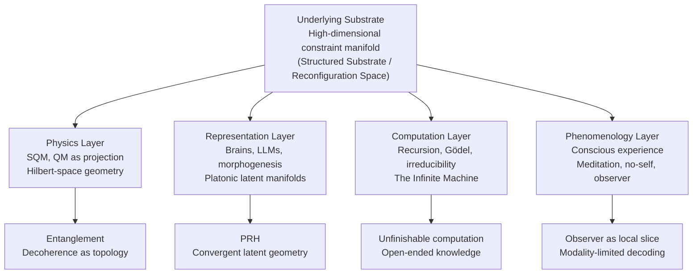
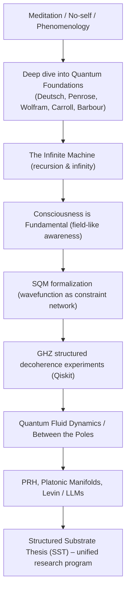

# **Structured Substrate Thesis (SST)**

### _A Unified View of Physics, Mind, Computation & Representation_

**Draft 1 – Roibín O’Toole**

---

# **0. Abstract**

This document presents the **Structured Substrate Thesis (SST)**.
It proposes that reality is an infinite, relational, constraint-based substrate from which physics, computation, representation, and conscious experience emerge as different projections.

Across quantum mechanics (SQM), decoherence experiments, cognitive science, AI latent manifolds (PRH), phenomenology, Gödel/Turing recursion, and fluid-dynamic metaphors of wavefunction flow, I argue that all these domains are cross-sections of one underlying structure.

---

# **1. One-Sentence Thesis**

> **Reality is an infinite, constraint-based substrate from which physics, observers, computation, and Platonic forms emerge as different projections; my work (SQM, GHZ experiments, The Infinite Machine, PRH, meditation) reveals this structure from multiple angles.**

---

# **2. Core Claims of SST**

## **2.1 There is an underlying substrate**

A high-dimensional, constraint-structured manifold:

- not material
- not mystical
- not purely observational
- **but real**

Working names (to be unified in future drafts):
**Structured Substrate**, **Reconfiguration Space**, **Platonic Manifold**.

This is the arena where reality actually happens.

---

## **2.2 Quantum mechanics is a _projection_ of this substrate**

**Structured Quantum Mechanics (SQM)** provides the interpretation:

- Wavefunction = real relational structure
- Decoherence = topological reconfiguration
- Entanglement = geometric binding
- Measurement = structural boundary imposition (not literal collapse)
- Standard QM = partial view from within the structure

Decoherence is not random decay but **channelled turbulence**.

---

## **2.3 Observers and models are _decoders_ of the substrate**

Brains, cells, dolphins, dogs, LLMs, and morphogenetic systems:

- Converge on similar representational manifolds
- Extract **invariants** of the substrate
- Build world-models from limited perspectives

This aligns with:

- Michael Levin’s work
- PRH (Platonic Representation Hypothesis)
- Category-theoretic and geometric views of representation
- LLM latent-space convergence

Forms = stable invariants in the substrate.

Representers don’t invent them; they **decode** them.

---

## **2.4 Conscious experience = what local decoding feels like from the inside**

From meditation and phenomenology:

- No-self is simply “no intrinsic local anchor”
- Awareness is field-like
- Experience arises from navigating a slice of the substrate
- Brain = interface for decoding structural constraints
- Consciousness = traversal of relational structure in a recursive loop

This is not naive panpsychism.
It’s **embedded structuralism**: experience as what structural traversal feels like.

---

## **2.5 Recursion, Gödel, and irreducibility explain why any view is partial**

- Gödel: no system can contain its own full truth
- Turing: no shortcut around irreducible processes
- Wolfram: complexity emerges at the boundary of simple rules
- Deutsch: open-ended knowledge is structural
- _The Infinite Machine_: infinity as unfolding, not endpoint

The substrate is infinite → all observers have necessarily partial projections.

---

## **2.6 Infinity = structure without end**

Infinity is not a quantity; it is **the shape of the recursive substrate**.

Thus:

- No final theory
- Science = refinement of invariants
- Physics, representation, AI, and phenomenology = coordinated glimpses into structured infinity

---

# **3. The Layer Model of SST**

A map of how the domains interrelate:

---

# **4. Mapping My Work Onto the Structure**

```mermaid
graph TD
    A["Structured Substrate Thesis (SST)"]

    subgraph P["Physics / SQM"]
        SQM["Structured Quantum Mechanics"]
        GHZ["Structured Decoherence Experiments (GHZ3, Qiskit)"]
        FLOW["Between the Poles / Quantum Fluid Dynamics"]
        MAJ["Tunneling, Braiding & Majoranas"]
    end

    subgraph COM["Computation / Infinity"]
        INF["The Infinite Machine"]
        GODEL["Gödel / Recursion / Irreducibility Notes"]
        LOOP["Shift from Loops to Graphs"]
    end

    subgraph REP["Representation / Forms"]
        PRH["Platonic Representation Hypothesis (LLMs)"]
        LATENT["Latent Space Geometry / AI-first workflows"]
    end

    subgraph PHE["Phenomenology / Mind"]
        CONS["Consciousness is Fundamental (Meditation)"]
        STRANGE["Strange Loops & Awareness"]
        OBS["Observer-as-Slice"]
    end

    A --> SQM
    A --> GHZ
    A --> FLOW
    A --> MAJ

    A --> INF
    A --> GODEL
    A --> LOOP

    A --> PRH
    A --> LATENT

    A --> CONS
    A --> STRANGE
    A --> OBS
```

---

# **5. Unified Explanation of the Substrate**

This section merges the “reconfiguration space” view with SST.

---

## **5.1 What the Structured Substrate Is**

The **structured substrate** is:

- a high-dimensional relational manifold
- defined by constraints, not objects
- evolving deterministically
- generating classicality via boundary reconfigurations
- sampled by observers as limited projections

Mathematically it looks like Hilbert space, **plus**:

- topology of entanglement
- constraint networks
- decoherence flow geometry
- amplitude flow dynamics
- irreducible recursive evolution

Not “Hilbert as abstraction”;
**Hilbert + structure + dynamics + topology** as the real arena.

---

## **5.2 Wavefunction as Fluid: A More Intuitive Ontology**

Fluid model:

- Hamiltonian = riverbed
- Wavefunction = quantum fluid
- Gates = poles that split and redirect amplitude
- Decoherence = turbulence / channeling
- Error correction = dams and stabilizers
- Measurement = basin where channels converge
- Entanglement = coupled flow constraints across subsystems

This is a **structural ontology**, not just a metaphor.

Supported by:

- GHZ decoherence experiments
- structured noise pathways
- non-uniform mutual information decay
- topological quantum matter (Majoranas, anyons)

---

## **5.3 Decoherence as Structured Reconfiguration**

Key empirical intuition:

> Decoherence does not produce uniform randomness.
> It follows **preferred channels** in reconfiguration space.

Patterns seen:

- Biases in bitstring frequencies
- Non-maximal entropy plateaus
- Persistent cross-qubit correlations
- Divergence from naive i.i.d. noise models
- Robustness of certain classical configurations

Thus:

- “collapse” ≈ local loss of access to global constraints
- classicality ≈ projection onto stable submanifolds
- noise ≈ structured reconfiguration, not pure chaos

---

## **5.4 Time, Dynamical Laws, and Recursion**

In reconfiguration space:

- “state at t” = one configuration
- “dynamics” = reconfiguration rules
- “laws” = stable transformation constraints
- “measurement” = selecting a compatible configuration under boundary conditions
- “irreversibility” = information dispersion across constraints
- “randomness” = observer ignorance of full structure

Time is a **bookkeeping axis** emergent from these reconfigurations, not a primitive variable of the substrate.

---

## **5.5 Relations Over Objects**

Particles are not fundamental things.

They are:

- localized stable patterns
- whirlpools in a relational field
- emergent boundary-locked configurations
- manifestations of deeper constraint structure

Reality is **relation-based**, not object-based.

We see this in:

- configuration-space wavefunctions
- entanglement
- topological modes (Majoranas, anyons)
- LLM representational geometry
- morphogenesis (bioelectric attractors)
- phenomenology of awareness
- recursion in computation and knowledge

---

# **6. Representation, PRH, & Platonic Manifolds**

LLMs, brains, cells, and evolutionary processes all converge toward:

- low-dimensional manifolds
- stable invariants
- cross-platform representational similarity
- geometry-encoded content

This aligns with:

- PRH (Platonic Representation Hypothesis)
- geometrization of learning
- Levin’s morphogenetic landscapes
- category-theoretic ideas (functors between domains)
- convergent architecture in AI (transformers, embeddings)

Forms are not “in the mind”.
They are **stable attractors in the structured substrate**.

Representational systems just learn to **land on them**.

---

# **7. Phenomenology: Consciousness as Local Traversal**

Meditation and phenomenology contribute the experiential layer:

- No-self = recognition that “self” is a model, not an entity
- Awareness = field-like, prior to specific content
- Experience = structured boundary in the substrate
- Thought = recursive reconfiguration of that structure
- Consciousness = what it feels like when a decoder traverses the substrate from within
- Self-model = constraint-stabilized narrative loop

The structure of subjective experience rhymes with:

- decoherence boundary formation
- relationalism
- recursive knowledge generation
- graph traversal (over simple loops)
- phenomenology of time as change, not as absolute axis

Consciousness is not fundamental.
**Structure is fundamental.**
Consciousness is what _structure-with-a-self-model_ feels like.

---

# **8. Recursion, Gödel, Irreducibility, Infinity**

_The Infinite Machine_ and related notes form the computation layer:

- Gödel: embedded systems cannot see whole structure from within
- Turing: some processes are irreducible; no shortcut exists
- Deutsch: explanations are open-ended
- Wolfram: complexity from simple rules at the boundary
- Hofstadter: strange loops and self-reference
- Physics: recursive evolution in reconfiguration space
- Awareness: recursion in thought and self-modeling
- LLMs: structural inference without explicit enumeration
- Infinity: an ongoing process, not a finished object

Infinity is the **unboundedness of structural unfolding**, not a number.

---

# **9. Timeline of Intellectual Development**

---

# **10. Reusable Summary Paragraph (for README, papers, website)**

> The **Structured Substrate Thesis (SST)** proposes that reality is an infinite, constraint-based substrate from which physics, observers, computation, and abstract forms arise as different projections. My work develops this through **Structured Quantum Mechanics (SQM)**, treating the wavefunction as a real relational structure and decoherence as topological reconfiguration; through **The Infinite Machine**, exploring recursion and irreducibility; through GHZ decoherence experiments revealing structured noise; through meditation-based phenomenology; and through the **Platonic Representation Hypothesis (PRH)**, showing convergence of latent manifolds in minds, cells, and AI. All of these are cross-sections of the same architecture: reality as structured infinity.

---

# **11. Testable Hypotheses & Experiments**

This section gives SST some “teeth”: concrete, falsifiable hypotheses you can probe with your existing GHZ/Qiskit framework and related tools.

I’ll name them so you can reference them later (H_Q1 etc).

---

## **11.1 H_Q1 – Structured Decoherence Pathways in GHZ States**

**Informal statement**

> When a maximally entangled GHZ state is exposed to realistic noise, decoherence does not spread probability mass uniformly through the computational basis. Instead, it follows a small number of **preferred structural pathways** in reconfiguration space, producing:
>
> - non-maximal entropy plateaus,
> - persistent multi-qubit correlations,
> - and a bitstring distribution that is better explained by a _low-dimensional pathway model_ than by simple i.i.d. noise.

**System**

- (n = 3) or (n = 4) qubit GHZ state:
  (|\text{GHZ}\_n\rangle = (|0...0\rangle + |1...1\rangle)/\sqrt{2})
- Noise models you can control in your framework:
  - local depolarizing
  - local dephasing
  - amplitude damping
  - correlated noise (if supported)

**Protocol (simulation or hardware)**

1. Prepare GHZ_n.
2. Apply a parameterized noise channel (\Lambda(p)) for various noise strengths (p).
3. Measure in the computational basis, collecting (N) shots per configuration (e.g. 4096+).
4. For each noise setting, compute:
   - bitstring frequencies (P(\mathbf{x}))
   - Shannon entropy (H(P))
   - pairwise mutual information (I(q_i : q_j)) and possibly multi-information
   - KL divergence (D*{\text{KL}}(P | P*{\text{model}})) for various baseline models.

**Baseline models**

- **M1: Ideal GHZ + i.i.d. bit-flip noise**
  Start from ideal GHZ outcomes ({000..., 111...}) and then apply independent classical bit flips with probability (p\_{\text{eff}}). This yields a binomial-like distribution over Hamming weights.
- **M2: Maximal ignorance model**
  Uniform distribution over all (2^n) bitstrings (max entropy).
- **M3: Generic diagonal Lindblad model**
  A simple Markov chain on basis states with no structured couplings.

**Prediction**

- Realistic quantum noise (even in simulation with physically motivated channels) will produce distributions that:
  - have **significantly lower entropy** than M2 at comparable effective error rates;
  - maintain **non-zero mutual information** (I(q_i : q_j)) beyond what M1 predicts;
  - are better fit by a **low-rank “pathway model”** (e.g. a small set of dominant transitions like
    (|000\rangle \leftrightarrow |111\rangle \rightarrow {\text{few specific leakage states}}))
    than by fully spread-out noise.

In other words:

> The diagonal of (\rho(t)) lives in a **low-dimensional manifold** inside the full probability simplex, even under substantial decoherence.

**Falsification**

H_Q1 is falsified if, for increasing noise:

- measured distributions become well-approximated by M1 or M2 (high entropy, weak correlations);
- mutual information decays to zero as soon as the overall error rate is moderate;
- no small set of “pathway transitions” explain most of the probability mass.

---

## **11.2 H_Q2 – Noise Geometry vs Synthetic Randomness**

This sharpens H_Q1 by directly contrasting **structured quantum noise** with deliberately **unstructured classical scrambling**.

**Informal statement**

> Realistic decoherence (even in simulation) leaves a signature of geometric structure that cannot be reproduced by simply taking ideal outcomes and randomly scrambling bits with the same single-qubit error rates.

**Protocol**

1. Use the same GHZ + noise setup as in H*Q1 to obtain a “real” noisy distribution (P*{\text{real}}).
2. From the same ideal GHZ state, generate a “synthetic” distribution (P\_{\text{synthetic}}) by:
   - sampling ideal GHZ outcomes;
   - then applying independent classical bit-flips or bit-phase flips with tuned error rates (p*i) so that e.g. marginal error rates match those of (P*{\text{real}}).

3. Compare:
   - (H(P*{\text{real}})) vs (H(P*{\text{synthetic}}))
   - (I(q_i : q_j)) for both
   - KL divergence (D*{\text{KL}}(P*{\text{real}} | P\_{\text{synthetic}}))
   - higher-order correlation structure (e.g. multi-information).

**Prediction**

Even with matching single-qubit error rates:

- (P\_{\text{real}}) will show **richer correlation structure** (non-trivial multi-qubit couplings).
- (P\_{\text{synthetic}}) will look like a smeared-out, nearly factorized noise model.
- The KL divergence will remain significantly non-zero over a range of noise strengths.

Operationally:

> You cannot fully mimic quantum decoherence by classical “scramble the bits” models without introducing explicit structured correlations.

---

## **11.3 H_Q3 – Sensor-Qubit Flow Tracing**

This tests the idea that **subsystems can act as “dye tracers” of reconfiguration flow**, revealing mid-stream structure of decoherence.

**Informal statement**

> If you embed a small “sensor” subsystem into a larger entangled state and expose the whole system to noise, then correlations between the sensor and main system will reveal preferred decoherence channels — effectively letting you probe the geometry of reconfiguration mid-stream.

**System**

- Main system: GHZ_n or some other entangled state on (n) qubits.
- Sensor(s): 1–2 additional qubits entangled with the main system in a controlled way.

**Example construction**

- Prepare GHZ_3 on qubits 0–2.
- Use a controlled operation to entangle qubit 3 (sensor) with some parity or logical property of the main system.
- Optionally add qubit 4 as second sensor with a different entangling map.

**Protocol**

1. Prepare main+sensor entangled state.
2. Let the entire system evolve under noise channel (\Lambda(p)) for different (p) or times.
3. Measure:
   - sometimes only the sensors,
   - sometimes the full system,
   - or condition on sensor outcomes and examine main system distributions.

4. Compute:
   - (I(\text{sensor} : \text{main})) as a function of noise strength
   - conditional distributions of the main system given sensor outcomes
   - whether particular sensor outcomes correlate with particular decoherence pathways in the main system.

**Prediction**

- For a well-designed sensor entangling map, specific sensor outcomes will be **biased toward particular main-system pathways** (e.g. certain leakage states).
- This will let you infer something like “when the sensor is 1, the main system is more likely to have followed pathway A than B”.

In other words:

> There exists a class of sensor couplings that make mid-stream reconfiguration structure _operationally accessible_ without full tomography.

---

## **11.4 H_R1 – Representation–Substrate Alignment in Latent Space**

This one is more conceptual / data-sciencey, but still testable in principle.

**Informal statement**

> When a model (LLM or other) is trained on data generated by a system with known symmetry/constraint structure, its latent manifold will align with those constraints in a low-dimensional way. That is, principal directions in the latent space will correlate with true invariants of the generating process.

For example:

- Train a model on trajectories of a simple physical system (e.g. harmonic oscillator, Ising model snapshots, or even your own GHZ measurement distributions under varying noise).
- Examine the latent embeddings (e.g. of states, samples, or time steps).
- Check whether their geometry reflects true parameters (frequency, coupling strength, noise level, etc.)

**Prediction**

- Latent dimensions will correlate in a smooth, often nearly-linear way with **true underlying structural parameters** of the data-generating process.
- Different architectures or modalities (e.g. LLM vs autoencoder) will learn **similar latent manifolds**, supporting the PRH idea of convergent Platonic representation.

This doesn’t prove SST, but it supports the claim:

> Decoders converge on the same underlying invariants of the structured substrate.

---

# **12. First Experimental Evidence: Fog vs River in GHZ₄ Decoherence**

Using my refactored Qiskit experiment framework (`refactor/simplify-codebase`), I ran an explicit implementation of **H_Q1** on a 4-qubit GHZ state to compare:

- **Maximal-ignorance noise** (depolarizing), vs.
- **Directional, physically structured noise** (amplitude damping).

### 12.1 Setup

- Target state:
  \[
  |\text{GHZ}\_4\rangle = \frac{|0000\rangle + |1111\rangle}{\sqrt{2}}
  \]
- Noise models:
  - Depolarizing channel (unstructured, isotropic in the computational basis),
  - Amplitude damping channel (structured energy relaxation, \( |1\rangle \to |0\rangle \)).
- Sweep:
  - Error rate γ from 0.0 to 0.5 (20 steps),
  - 4096 shots per configuration,
  - Qiskit Aer QASM simulator.
- Metrics:
  - Probability distribution over all 16 bitstrings,
  - Shannon entropy \(H(P)\),
  - Pathway Concentration Ratio (PCR) – adapted from economic inequality measures (Palma ratio),
  - Gini coefficient as an additional inequality metric.

The framework separates physics from orchestration:

- `src/engine` – execution engine (API: `run()`, `sweep()`)
- `src/experiments` – pluggable experiment programs (`ExperimentProgram` protocol)
- `src/core/noise_models` – physics-first noise factory (enforcing constraints like \(T_2 \le 2T_1\))
- `src/core/analysis` – metric library (PCR, Gini, entropy, etc.)

### 12.2 Depolarizing Noise: The Fog

Under depolarizing noise at γ = 0.5, the GHZ₄ state exhibits **pathway explosion**:

- All 16 basis states are populated:
  - `0000` ≈ 667 counts,
  - `1111` ≈ 657 counts,
  - many other states (`0001`, `1110`, `0011`, `1100`, `0101`, …) in the ~100–350 range.
- Entropy is high, and the support covers essentially the full basis.
- PCR is paradoxically **high (~95)**:
  - The “top quartile” (signal peaks) is large,
  - The “bottom quartile” (rare error states) is nonzero but thin,
  - So the signal-to-tail ratio becomes large even though probability has leaked everywhere.

Interpretation:

> Depolarizing noise behaves like a **fog** in reconfiguration space: it spreads probability mass broadly and almost isotropically. The environment couples to the system in “all directions,” consistent with a maximal-ignorance model.

This matches the SST picture of **unstructured decoherence**: no preferred pathways, high entropy, many weakly populated states.

### 12.3 Amplitude Damping: The River

Under amplitude damping at γ = 0.5 (with a corrected noise implementation that also acts on CNOTs), the behavior is qualitatively different:

- Ground state as sink:
  - `0000` ≈ 3403 counts (~83% of shots).
- Excited state depletion:
  - `1111` ≈ 17 counts (< 0.5%).
- A small set of **intermediate states** as transient waypoints:
  - `0001` ≈ 317,
  - `0010` ≈ 87,
  - `0011` ≈ 78,
  - `1110` ≈ 21,
  - most other states have negligible or zero population.

Entropy here is **much lower** than for depolarizing noise at the same γ.

PCR is also **high (~77)**, but for a different reason:

- The distribution is genuinely **concentrated** in a small subspace:
  - one dominant sink (`0000`),
  - a handful of structured intermediates,
  - a very small and mostly irrelevant tail.

Interpretation:

> Amplitude damping behaves like a **river**: probability flows directionally from the highly excited GHZ configuration (`1111`) through a small number of preferred pathways into the ground state (`0000`). Decoherence is a **directed current** in the constraint network, not a uniform spray.

This strongly supports the SST claim that **decoherence is geometric**:

- The environment does not couple blindly to all directions in reconfiguration space.
- Instead, it defines **preferred channels** (in this case along energy-relaxation gradients), producing:
  - lower entropy,
  - sparse support,
  - and an interpretable flow structure in Hamming-weight space.

### 12.4 Implications for H_Q1

H_Q1 can now be sharpened:

> For entangled states such as GHZ, physically structured noise (like amplitude damping) produces low-entropy, strongly anisotropic distributions supported on a small subset of basis states, with a clear flow from source to sink, whereas maximally mixed noise models (like depolarizing) produce high-entropy, broadly populated distributions.

The **Fog vs River** dichotomy is the first concrete empirical signature of the **Structured Substrate Thesis**:

- Fog = noise that effectively ignores the geometry of the substrate (isotropic scattering),
- River = noise that respects and _traces_ the geometry (directed flow along constraint-defined channels).

Next steps (H_Q2, H_Q3):

- Extend this comparison to deeper circuits and other entangled states.
- Contrast quantum noise with synthetic classical scrambling to test how much of the “river” structure can be mimicked without full quantum dynamics.
- Design “sensor qubits” that act as dye tracers for these flows in larger systems.

---

# **13. Open Research Program (Early Notes)**

These are broader directions, some of which connect directly to H_Q1–H_Q3 and H_R1.

- Map structured decoherence channels empirically (GHZ_n, cluster states, W states).
- Compare real-noise vs synthetic random noise (H_Q2).
- Build sensor-qubit subspaces to detect mid-stream reconfiguration (H_Q3).
- Study topological modes (Majoranas) as stable configurations in the substrate.
- Formalize LLM latent-space invariants (H_R1, PRH alignment).
- Explore recursive observer models (phenomenology → representation → physics).
- Build computational simulations of reconfiguration flow (fluid-dynamics analogues).
- Develop mathematical formalization of the substrate (category theory / differential geometry / topological QFT).

---

# **14. Closing**

SST is not a final theory.
It is a unifying insight — a way of seeing.

Physics, computation, consciousness, and representation
are not separate domains.

They are the same structure seen through different apertures.

This document is the first fully unified draft of that vision, now with concrete hypotheses that can be sharpened, tested, and iterated.

---
