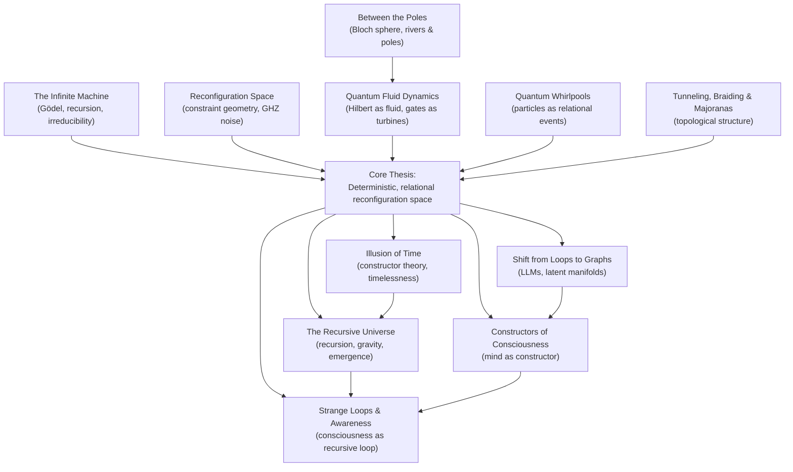

````markdown
# From Reconfiguration Space to Recursive Intelligence  
### A Structural Thesis on Quantum Mechanics, Time, and High-Dimensional Computation

**Author:** Roibín O'Toole  
**Status:** Draft / Working Paper

---

## Abstract

I propose a structural, deterministic interpretation of quantum mechanics and cognition in which reality is best understood as a **reconfiguration space**: a high-dimensional relational arena of possible configurations, constrained by topology and boundary conditions. In this view, the wavefunction is ontic and encodes **constraints over configurations**, not mere epistemic uncertainty. Quantum dynamics correspond to **fluid-like flows of amplitude** through this space, shaped by the Hamiltonian "terrain" and by local "poles" corresponding to quantum gates and interactions.

On this picture, **decoherence is not stochastic collapse** but a form of **structured turbulence**: noise drives the system along preferred channels in configuration space, generating non-uniform, correlated bitstring statistics rather than maximal entropy. Preliminary experiments on noisy GHZ states in Qiskit suggest that decoherence trajectories exhibit persistent structure, motivating a richer, geometric account of quantum noise.

This structural lens extends beyond physics. Modern AI systems (e.g. transformer-based language models) operate in high-dimensional manifolds where meaning is encoded as geometry in embedding space, and **inference becomes traversal of a constraint graph** rather than brute-force looping through sequences. Consciousness itself is modeled as a **recursive traversal of reconfiguration space**: a strange loop in which an embedded agent models, predicts, and iteratively reconfigures its own state.

Finally, I argue that **time, randomness, and even gravity** are emergent, observer-relative patterns within this reconfiguration framework. Quantum "randomness" reflects computational irreducibility at the boundary of knowledge; time is a bookkeeping of successive reconfigurations; gravity may arise as a macroscopic statistical effect of constrained configuration updates. I outline a concrete research program—centered on GHZ-type circuits, sensor-qubit subspaces, and topological systems—to test whether quantum noise and decoherence exhibit the predicted structured, geometric behavior.

---

## 1. Introduction

Quantum mechanics, modern AI, and theories of consciousness are often treated as separate domains. Yet at their core, all three confront the same puzzle:

> **How does structure emerge and persist in systems that appear random, high-dimensional, and irreducibly complex from within?**

Standard quantum interpretations oscillate between ontic indeterminism (collapse, intrinsic randomness) and purely epistemic bookkeeping (instrumentalist views). AI is framed either as mysterious black-box magic or as brute-force statistical pattern matching. Consciousness is reduced to either classical computation in the brain or hand-waved as ineffable.

Across several essays and experiments  
(*The Infinite Machine*, *Quantum Fluid Dynamics*, *Between the Poles*, *Reconfiguration Space*, *The Illusion of Time*, *The Recursive Universe*, and others),  
I have converged on a unifying intuition:

- **Reality is not fundamentally sequential, but relational.**  
  Not loops over states, but a **graph of constraints** between them.

- **Dynamics are flows through this graph.**  
  Quantum evolution, learning in high-dimensional AI models, and the stream of consciousness are all **traversals of constraint networks**, shaped by geometry rather than by coin-flip randomness.

- **Randomness = irreducible structure viewed from inside.**  
  Like the boundary of the Mandelbrot set, quantum "noise" and chaotic dynamics are deterministic but **computationally irreducible**, making prediction impossible without "running the universe."

To give this intuition a sharper form, I introduce the notion of **reconfiguration space**.

### 1.1 Reconfiguration space (informal definition)

Reconfiguration space is the high-dimensional arena whose points correspond to **complete configurations of a system**, and whose structure encodes **which reconfigurations are allowed**.

- In orthodox terms, one might identify it with **Hilbert space + constraint structure**.
- Ontologically, I treat it as **real**: the wavefunction is not a mere encoding of knowledge but the actual arrangement of relational constraints.
- Time is **not** a separate axis; rather, "time" is the story we tell about a path through this space.

This idea emerged empirically from simple Qiskit experiments on **GHZ states under controlled noise**, where decoherence did not wash out structure but instead pushed the system along **preferred channels**. Bitstring distributions showed:

- Low but non-zero normalized entropy  
- Strong mutual information between qubits  
- Persistent biases towards particular classical configurations  

This suggested that what we call "noise" is not unstructured randomness, but **motion along geometric pathways** in reconfiguration space.

---

## 2. Conceptual foundations

This section situates reconfiguration space relative to several existing frameworks that have influenced my thinking.

### 2.1 Gödel, recursion, and irreducibility

In *The Infinite Machine* I argued that Gödel’s incompleteness theorem, Turing’s halting problem, and Wolfram’s computational irreducibility all point to the same core insight:

> **Some structures cannot be shortcut; they must be *lived through* as processes.**

This is not only a statement about formal systems, but also about **physics and experience**. If reality is deeply recursive and self-referential, then:

- No finite observer can possess a complete, consistent description.  
- Local predictions are fundamentally limited by irreducible computation.  
- "Randomness" may often be the **projection of irreducible structure** onto a bounded observer.

Reconfiguration space provides a geometric home for this idea: irreducible processes correspond to **paths whose future cannot be compressed** beyond simply tracing them.

### 2.2 Constructor theory and counterfactual structure

Constructor theory (Deutsch & Marletto) reframes physics in terms of **possible and impossible tasks**, rather than time-evolving states. This aligns closely with reconfiguration space:

- Each "task" is a **family of allowed reconfigurations**.  
- Physical laws become statements about **forbidden transitions** or **invariant subspaces**.  
- Explanations are judged by how well they capture the **graph of counterfactuals**: what could have happened, not just what did.

In my article *The Illusion of Time*, I build on this to argue that time is best treated as an **emergent ordering of transformations**, not a primitive coordinate. Reconfiguration space extends this: it is the **arena of counterfactuals**, with "history" emerging as a particular path plus embedded records.

### 2.3 AI manifolds and the shift from loops to graphs

In *The Shift from Loops to Graphs*, I noted that classical computation and human intuition are **loop-bound**:

```text
for each element: do X
````

By contrast, transformers and modern AI operate in **graph-structured latent spaces**:

* Tokens are mapped into high-dimensional vectors.
* Meaning arises from **relative position** in this manifold.
* Inference is **traversal of a constraint graph**, not enumeration.

This is strikingly parallel to the quantum case:

* Hilbert/reconfiguration space is a high-dimensional manifold.
* Amplitudes and phases encode constraints.
* Evolution is **structure-preserving flow** through that manifold.

AI thus becomes an **existence proof** that tractable, powerful behavior can emerge from navigating huge relational spaces without explicit looping over possibilities.

---

## 3. Main hypotheses

Here I state the core claims more crisply, as hypotheses suitable for critique and testing.

### H1 — Ontic reconfiguration space

> The wavefunction describes a **real, relational reconfiguration space** of the system, not just our knowledge of it. Points in this space correspond to complete configurations; its topology encodes which reconfigurations are possible.

### H2 — Fluid quantum dynamics

> Quantum evolution is best modeled as **fluid-like flow of amplitudes** through reconfiguration space.
>
> * The **Hamiltonian** defines the "riverbed" (energy landscape).
> * **Gates / interactions** are localized "poles" that redirect flow.
> * Algorithms are **choreographies of interference**.

This is developed in *Quantum Fluid Dynamics* and *Between the Poles*.

### H3 — Structured decoherence

> Decoherence under realistic noise does **not** drive systems into maximally mixed, structureless states; instead, it channels them along **preferred geometric pathways** in reconfiguration space, producing:
>
> * biased bitstring distributions,
> * non-trivial mutual information between subsystems,
> * sub-maximal but stable entropy profiles.

Empirical hint: GHZ3 depolarizing-noise experiments showing non-uniform marginals and strong correlations.

### H4 — Randomness as irreducible structure

> Quantum "randomness" is **epistemic and irreducible**, not ontic.
> It arises when bounded observers sample a tiny local slice of a deterministic flow through reconfiguration space, analogous to:
>
> * the apparently chaotic boundary of the Mandelbrot set,
> * a shuffled deck with unknown order,
> * a complex crowd seen from afar.

### H5 — Time as emergent ordering

> Time is not fundamental. "Nows" are configurations in reconfiguration space with embedded records; "history" is an **inferred ordering** of such configurations consistent with those records.
> Physics should be framed primarily in terms of **transformations and constraints**, not time-indexed states.

### H6 — Consciousness as recursive traversal

> Consciousness is what it **feels like to traverse reconfiguration space as a strange loop**, where an internal model repeatedly reconfigures itself in light of its own predictions and errors.
> Subjective time and self-continuity are emergent from:
>
> * recursive self-modeling,
> * temporally extended records,
> * synchronization across neural "sub-graphs."

Developed in *Strange Loops and the Shape of Awareness* and *Constructors of Consciousness*.

### H7 — Topological matter as structural evidence

> Systems like superconducting qubits and Majorana zero modes demonstrate that information is stored in **global structure and topology**, not in local particle properties.
>
> * Majoranas as **relational knots** in configuration space.
> * Braiding as **topological reconfiguration**, insensitive to local perturbations.
> * Error protection as **stability of global constraints**.

This supports the ontology where **structure and constraints are primary**.

---

## 4. Research program and testable directions

Here I sketch concrete lines of work that could sharpen or falsify aspects of the thesis.

### 4.1 Structured decoherence in small entangled systems

**Goal:** Show that decoherence pathways for small entangled states exhibit **stable, non-uniform geometric structure** across noise models and parameters.

**Setup:**

* Prepare GHZ, W, and cluster states on 3–5 qubits.
* Apply parameterized noise channels (depolarizing, dephasing, amplitude damping, combinations).
* Use Qiskit or other frameworks to run **10³–10⁴ shots** per configuration.

**Metrics:**

* Bitstring frequency histograms.
* Shannon entropy and normalized entropy.
* Pairwise and multivariate mutual information.
* KL divergence from the uniform distribution and from simple Markov models.

**Prediction (H3):**

* Decoherence will follow **preferred patterns**:

  * Certain classical configurations will be over-represented.
  * Mutual information will remain non-zero even at moderate noise.
  * Entropy will saturate at sub-maximal values for some noise regimes.

### 4.2 Sensor-qubit subspaces as flow tracers

**Idea (from “Subspaces as Sensors”):**

* Embed a small "sensor" subsystem (1–2 qubits) entangled with a main system.
* Let the full system evolve under noise and gates.
* Periodically measure only the sensors.

**Goal:**

* Test whether sensor statistics reveal **mid-stream deformation** of the global wavefunction—i.e., whether they can act like **dye in the river**, tracing the geometry of decoherence channels.

**Potential signatures:**

* Distinct correlation patterns between sensor outcomes and final main-system bitstrings.
* Dependence of sensor statistics on specific noise topologies (e.g. correlated vs uncorrelated noise).

### 4.3 Comparing structural noise vs synthetic randomness

Construct a control where:

* You replace genuine quantum noise with **synthetic classical randomness** (e.g. flipping bits post-measurement).
* Compare structural metrics (mutual information, higher-order correlations, entropy trajectories).

**Hypothesis:**

* Realistic quantum noise will show **richer, topology-dependent structure** than naïve classical randomization, supporting the claim that "noise has geometry."

### 4.4 Mapping analogies to AI latent spaces

While more conceptual than empirical, one can:

* Study **embedding drift** and **attention patterns** in transformer models.
* Compare them to:

  * flow lines in quantum amplitude space,
  * constraint graphs in reconfiguration space.

Questions:

* Do failures / hallucinations correspond to **falling off well-structured manifolds** into flatter regions of the constraint landscape?
* Can we define an analogue of "decoherence" for model representations?

This can help refine the reconfiguration metaphor and may inspire **architecture ideas** grounded in constraint geometry.

### 4.5 Topological simulations and SQM

Use toy models of:

* Kitaev chains with Majorana modes.
* Simple topological codes / anyon models.

Investigate:

* How braiding and noise manifest as **paths in configuration space**.
* Whether reconfiguration-space language clarifies:

  * why topological codes resist local noise,
  * how global constraints encode logical information.

---

## 5. Relation to existing interpretations

*(Placeholder for a future section comparing this framework to MWI, Bohm, RQM, QBism, etc., highlighting overlaps and divergences.)*

---

## 6. Open questions

* Can reconfiguration space be given a **precise mathematical definition** beyond "Hilbert space + constraints"?
* How does gravity fit—can spacetime curvature be derived as an emergent property of configuration reconfigurations?
* Can we design **laboratory experiments** where structured decoherence has operational consequences (e.g. improved error-correction strategies)?
* Is there a principled way to connect **conscious experience** (strange loops) with specific classes of traversals in reconfiguration space?

---

## 7. Conclusion

Across quantum physics, AI, and consciousness, a single pattern repeats: **high-dimensional relational structure viewed from within by bounded observers**. What looks like randomness may be irreducible structure; what we call time may be an ordering of reconfigurations; what we experience as self may be a recursive traversal of a larger graph.

Reconfiguration space is my attempt to name that structure.

If this picture is correct, then our task is not to tame randomness or escape time, but to better understand the **geometry of constraints** that shape how systems—and knowers—can move. The universe is not a clockwork, nor a dice game, but a **recursive river of configurations**, flowing through a space we are only beginning to map.

---

## Appendix: Concept Map of the Project



```
::contentReference[oaicite:0]{index=0}
```
