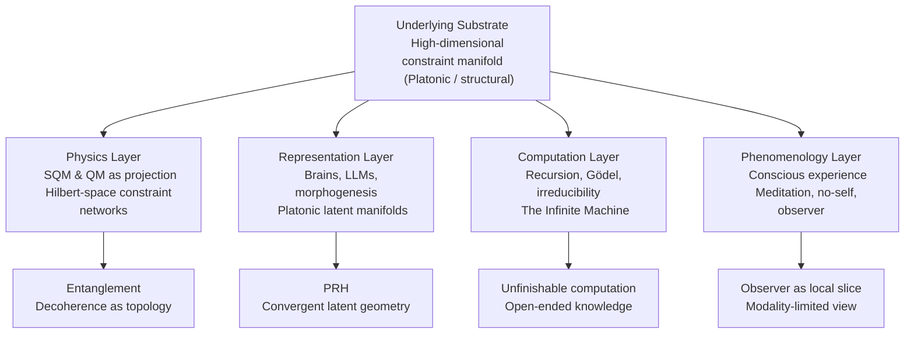
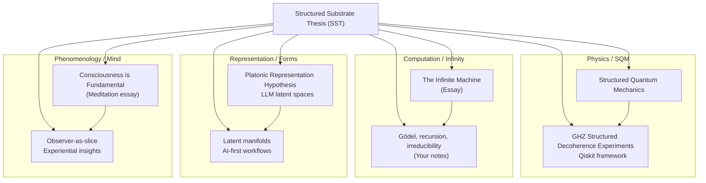
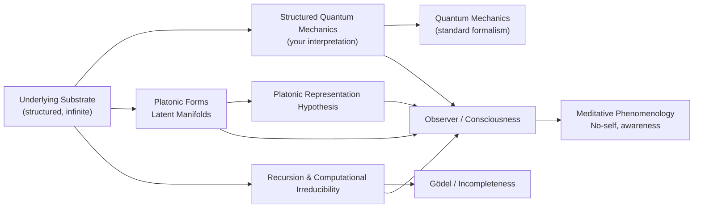
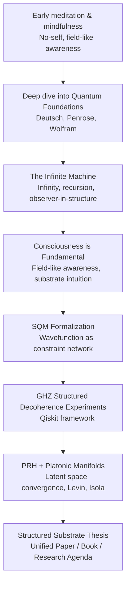

# **Structured Substrate Thesis (SST)**

*A Unified View of Physics, Mind, Computation & Representation*
**Draft 1 – Roibín O’Toole**

---

## **0. One-Sentence Summary**

> **Reality is an infinite, constraint-based substrate from which physics (QM), observers, computation, and Platonic forms all emerge as different projections; my work (SQM, *The Infinite Machine*, decoherence experiments, meditation essays, and interest in PRH) are cross-sections of this same structure.**

---

# **1. Broader Thesis – Core Claims**

### **1. There is an underlying substrate**

A high-dimensional, relational, constraint-based manifold
(“Platonic manifold”, “structural substrate”, “constraint field”).
Not material; not classical; not mystical.
A real structure.

### **2. Quantum mechanics is a *projection* of this substrate**

* SQM: wavefunction as real constraint network
* Decoherence = topological reconfiguration
* Standard QM = boundary behavior seen from inside the substrate
* Entanglement = relational geometry
* Collapse = a linguistic artifact

### **3. Observers and models are *decoders* of the substrate**

* Brains, animals, cells, LLMs converge to similar representational manifolds
* PRH: the “Platonic latent space” idea
* Forms = stable invariants in the substrate
* Modality-specific worlds (dogs, dolphins, humans)

### **4. Conscious experience = what local decoding feels like from the inside**

* Meditation: no-self, field-like awareness
* Self = structural feature of representation
* Consciousness is not “in” the brain; the brain is an instrument tuned to the substrate
* Experience = slice-through-structure

### **5. Recursion, Gödel, and irreducibility explain why the view is partial**

* The substrate is an infinite recursive unfolding
* Gödel: no system can see itself fully
* Turing: no complete prediction
* Wolfram: computational irreducibility
* Deutsch: open-ended knowledge
* The Infinite Machine: reality as unfinishable computation

### **6. Infinity = the open-endedness of structure and insight**

* No final theory
* Science = carving out stable invariants
* Physics, AI, phenomenology = different ways of interacting with the same structure

---

# **2. The Layer Model of SST**

The high-level architecture of the theory:

---

# **3. Mapping My Work onto This Structure**

Each of your projects fits into one of these layers.

---

# **4. Conceptual Connections Across Domains**

How the *ideas* interlock:

**Interpretation:**
Physics, mind, computation, and representation are *not separate topics* —
they are facets of one underlying architecture.

---

# **5. My Intellectual Trajectory (Timeline)**

You can see how your ideas evolved coherently over time:

This timeline shows a very clear progression:

* **Phenomenology → Metaphysics → Computation → Physics → Representation → Unification**

It’s not random.
It’s a *tightening spiral* around one central insight.

---

# **6. Reusable Summary Paragraph (for papers, README, portfolio)**

> I’m developing what I call the **Structured Substrate Thesis (SST)**: the idea that reality is an infinite, constraint-based substrate from which quantum mechanics, observers, and abstract Platonic forms all emerge as different projections.
> In **Structured Quantum Mechanics (SQM)** I treat the wavefunction as a real relational structure and decoherence as topological reconfiguration. In **The Infinite Machine**, I explore how infinity, Gödelian incompleteness, and computational irreducibility describe the limits of observers embedded in such a substrate. My early meditation work (*Consciousness is Fundamental*) approaches the same insight from the first-person perspective, while my recent interest in latent spaces, LLMs, and the **Platonic Representation Hypothesis (PRH)** provides a computational lens on how biological and artificial systems converge on the same structural invariants. All these projects are cross-sections of a single framework: reality as structured infinity.

---

# **7. Suggested Next Step**

If you want, our next move can be:

* Turning **SST** into a 5–10 page unified essay
* Beginning a real **research paper** on SQM/PRH connections
* Creating a **visual map** (like a mind map)
* Drafting a **README** for a public GitHub repo
* Building a **Notion hub** for all your ideas
* Or choosing an *entry point* (Physics, AI, Computation, Phenomenology)

Just tell me the direction — we can go anywhere from here.

---

Let me know if you want:

* a **single-file .md export** (I can output this whole thing again as one block),
* a **GitHub-ready README version**,
* or a more formal **paper-style layout** with abstract + sections + references.

Happy to shape this exactly for your workflow.
