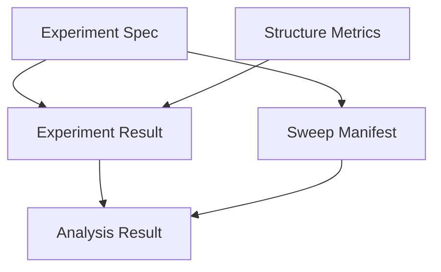

Got it — here’s your **README.md** with the **Schema Freeze Notice + Future Nice-to-Haves** appended at the end.

---

# Quantum Experiment Schema Suite (V1.0)

This repo defines **five JSON Schemas** that form a coherent pipeline for running,
storing, and analyzing quantum experiments. The schemas are versioned together (V1.0) and are **normalized** to avoid duplication.

---

## 📂 Folder Structure

```
schemas/
├── core/
│   ├── experiment_spec.schema.json
│   ├── provenance.schema.json
│   └── structure_metrics.schema.json
│
├── execution/
│   ├── experiment_result.schema.json
│   └── sweep_manifest.schema.json
│
├── analysis/
│   └── analysis_result.schema.json
│
└── schema_index.json
```

### Rationale

- **core/** → reusable building blocks (`experiment_spec`, `provenance`, `structure_metrics`).
- **execution/** → results of actually running experiments (`experiment_result`, `sweep_manifest`).
- **analysis/** → aggregated summaries (`analysis_result`).
- **schema_index.json** → registry of all schemas and references.

This layout mirrors the workflow: **design → execution → analysis**.

---

## Schemas Overview

### 1. **core/experiment_spec.schema.json**

Planned configuration of a quantum experiment.

- Defines state type, qubit count, noise model, shots, research metadata.
- Acts as the **source of truth** for what was intended to run.
- Referenced by: `experiment_result`, `sweep_manifest`.

### 2. **core/structure_metrics.schema.json**

Standardized set of decoherence and structure metrics.

- Includes structure score, entanglement–error correlation, concentration index,
  total correlation, persistence, and complexity emergence score.
- All metrics carry values, 95% CIs, and validation status.
- Referenced by: `experiment_result`.

### 3. **execution/experiment_result.schema.json**

Captures the outcome of a single experimental run.

- Contains provenance (engine config hash, commit, backend).
- Stores raw counts, empirical frequencies, ideal distribution.
- Embeds `experiment_spec` (as snapshot) + `structure_metrics`.
- Referenced by: `analysis_result`.

### 4. **execution/sweep_manifest.schema.json**

Describes a systematic parameter sweep.

- Embeds a base `experiment_spec` and parameter ranges.
- Supports research metadata (hypothesis, expected trends).
- Controls execution (parallelism, seeds).
- Referenced by: `analysis_result`.

### 5. **analysis/analysis_result.schema.json**

Aggregated analysis across sweeps or experiment sets.

- Links back to the originating `sweep_manifest`.
- Contains arrays of `experiment_result`.
- Stores comparative metrics (trends, correlations, matrices).
- Summarizes conclusions with timestamp.

---

## Schema Relationships



---

## Usage Workflow

1. **Design** → Create `experiment_spec`.
2. **Sweep** → Wrap specs into `sweep_manifest` if exploring parameters.
3. **Run** → Execute and capture outputs in `experiment_result`.
4. **Measure** → Compute and attach `structure_metrics`.
5. **Aggregate** → Collect results in `analysis_result` for trends and conclusions.

---

## Versioning

- All schemas are currently at `schema_version: "1.0"`.
- Breaking changes will bump the major version across all files.
- Use the `engine_config_hash` to tie results back to simulator/hardware state.

---

## Quick Links

- [core/experiment_spec.schema.json](core/experiment_spec.schema.json)
- [core/structure_metrics.schema.json](core/structure_metrics.schema.json)
- [execution/experiment_result.schema.json](execution/experiment_result.schema.json)
- [execution/sweep_manifest.schema.json](execution/sweep_manifest.schema.json)
- [analysis/analysis_result.schema.json](analysis/analysis_result.schema.json)
- [schema_index.json](schema_index.json)

---

✅ With this `schema_index.json` and `README.md`, you now have:

- A **map of dependencies**.
- A **clear workflow** from spec → sweep → result → analysis.
- No more “where does this belong?” confusion.

---

# 🚀 Schema Freeze Notice – Version 1.0

As of **2025-08-16**, the **Quantum Experiment Schema Suite (v1.0)** is declared **frozen**.

This version is **research-ready** and **production-stable**. All five schemas have passed validation against the design checklist:

- **experiment_spec.schema.json** – experiment planning & intent
- **experiment_result.schema.json** – single-run outcomes & provenance
- **structure_metrics.schema.json** – standardized structural/decoherence metrics
- **sweep_manifest.schema.json** – parameterized sweeps & systematic exploration
- **analysis_result.schema.json** – aggregation, trends, and conclusions

✅ **Core coverage** – every stage of the workflow is represented
✅ **Reproducibility** – full provenance (commit, backend, config hash, timestamp)
✅ **Statistical rigor** – confidence intervals + validation status on all metrics
✅ **Research alignment** – 5-phase structure (validation → predictive)
✅ **Versioning discipline** – `"schema_version": "1.0"` enforced across suite

---

## 🔒 What this means

- Version **1.0 is stable** and should be used for all experiments going forward.
- **No further schema edits** will be made unless:

  - A **breaking change** is required → bump to `2.0`
  - A **non-breaking enhancement** (e.g. units, null models) is added → bump to `1.1`

---

## 🧪 Next Steps

- Begin running experiments using these schemas as the canonical structure.
- Generate validation + example JSON docs to verify real-world coverage.
- Collect feedback during research; schedule schema revisions only if necessary.

---

## 🌱 Future Nice-to-Haves (post-1.0 roadmap)

These are **not in v1.0** but may be considered for `1.1+` or `2.0`:

### General

- 🔧 **Units metadata** for all numeric metrics (`bits`, `probability`, etc.).
- 🔗 **Cross-references** (`related_experiments`, `related_sweeps`) to support comparative studies.

### structure_metrics

- 📊 **Null model parameters** alongside structure scores for better statistical context.
- 🧮 **Extra derived metrics** (e.g. spectral entropy, mutual info matrices).
- 🔍 **Metric provenance**: which analysis method produced which metric.

### experiment_spec

- 🧑‍🔬 **Custom operator definitions** (e.g. JSON encoding of circuits or Hamiltonians).
- 🔄 **Multiple noise models** combined (e.g. depolarizing + amplitude damping).
- 📝 **Tags / labels** for quicker indexing of experiment families.

### experiment_result

- 🔗 **Cross-experiment links** (e.g. calibration runs, control experiments).
- ⚡ **Raw snapshot storage** for backend configs (not just hash).
- 📦 **Compression / storage metadata** for large count datasets.

### sweep_manifest

- 🎛️ **Composite sweeps** (multi-parameter grids with constraints).
- 📐 **Adaptive sweeps** (where ranges depend on earlier results).
- 🕸️ **Topology sweeps** (explicitly vary qubit connectivity graph).

### analysis_result

- 📂 **Hierarchical aggregation** (nested analyses of sweeps).
- 🧭 **Confidence grading** of conclusions.
- 🗄️ **Method provenance**: exact analysis pipeline + software version.

---

👉 **Important:** Locking schemas now reduces churn and lets us focus on actual research, not endless redesign. Any “nice-to-have” ideas above will be logged for **future versions**.

---
